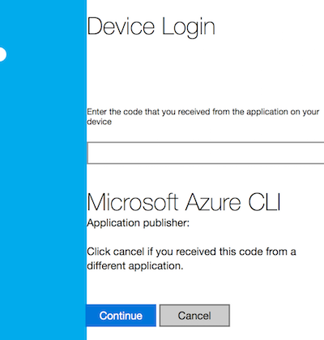
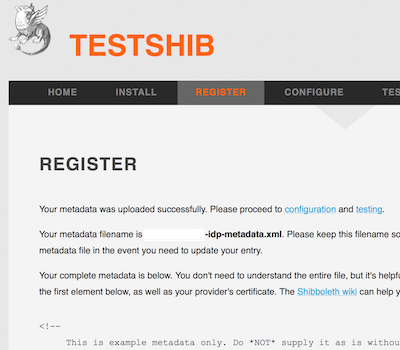
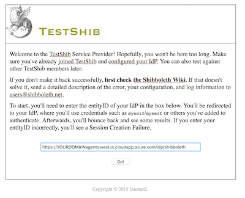
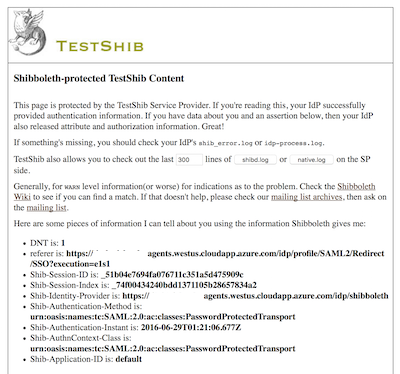

# Shibboleth IdP in Azure Container Service using Docker Swarm and the Azure CLI
This project details the steps required to host a Shibboleth 3 IdP in a Docker Swarm orchestrated Azure Container Service.   The implementation leverages Azure CLI, Docker, Docker Swarm, and the [Dockerized Unicon Shibboleth IdP](https://hub.docker.com/r/unicon/shibboleth-idp/) to stand all this up in less than 10 steps.

## Prerequisites
- Docker Toolbox (this tutorial used `Docker version 1.11.1, build 5604cbe`)
- An Azure Subscription (this tutorial used a free trial established using the [Azure Portal](http://portal.azure.com))

## Installation Steps
0. [Install the Azure CLI] (https://azure.microsoft.com/en-us/documentation/articles/xplat-cli-install/)
    - Available for OSX, Linux, Windows, or via Docker Container
    - This tutorial uses the Docker Container version for simplicity and cross-platform instructions
    - Open Docker Machine and run `docker run -it microsoft/azure-cli`
    - Expected Output:
      ```
                                                                                
      tim:~ tim$ docker run -it microsoft/azure-cli
      Unable to find image 'microsoft/azure-cli:latest' locally
      latest: Pulling from microsoft/azure-cli

      51f5c6a04d83: Pull complete 
      a3ed95caeb02: Pull complete 
      5996a9ae8e09: Pull complete 
      624a3861e862: Pull complete 
      246170e0971e: Pull complete 
      Digest: sha256:cc5c884f8918c51919ac3b042301d44f8d7434021acbbb633aa6241bd46ba8df
      Status: Downloaded newer image for microsoft/azure-cli:latest
      root@eb1881be249c:/# 
      ```
0. [Connect Azure CLI to Azure Subscription](https://azure.microsoft.com/en-us/documentation/articles/xplat-cli-connect/)
    - There are [various options for authenticating](https://azure.microsoft.com/en-us/blog/azure-cli-supports-microsoft-account-logins/) [more info on Microsoft Account types](https://msdn.microsoft.com/en-us/subscriptions/dn531048.aspx).
    - These instructions are using a free trial subscriptions associated with a Microsoft Account, so the only option is an interactive association.
    - In the Docker Machine that is hosting the Azure CLI, run `azure login`
    - This will prompt you with instructions on how to associate the Azure CLI with the previously established subscription.  It will require you to navigate to a URL in the browser of your choice, then enter a code.
    - 
    - Expected Output:
      ```
                                                                                
      root@eb1881be249c:/# azure login
      info:    Executing command login
      \info:    To sign in, use a web browser to open the page https://aka.ms/devicelogin. Enter the code FSTRSUL9B to authenticate.
      ```
    - After you follow those instructions, the process will complete the handshake
    - Expected Output:
      ```
                                                                                
      /info:    Added subscription Free Trial
      info:    Setting subscription "Free Trial" as default
      +
      info:    login command OK
      root@eb1881be249c:/# 
      ```
    - Validate this by running `azure account show`
    - Expected Output:
      ```
                                                                                
      root@eb1881be249c:/# azure account show
      info:    Executing command account show
      data:    Name                        : Free Trial
      data:    ID                          : YOURSUBSCRIPTION
      data:    State                       : Enabled
      data:    Tenant ID                   : YOURTENANT
      data:    Is Default                  : true
      data:    Environment                 : AzureCloud
      data:    Has Certificate             : No
      data:    Has Access Token            : Yes
      data:    User name                   : tim@YOURDOMAIN.com
      data:    
      info:    account show command OK
      root@eb1881be249c:/# 
      ```
0. The Azure CLI can run Azure Resource Manager (ARM) tasks, as well as Azure Service Manager tasks.  For these purposes, we'll be using ARM, so we need to switch the CLI to that mode:
    - Run `azure config mode arm`
    - For more information see the Azure CLI [command line reference](https://azure.microsoft.com/en-us/documentation/articles/azure-cli-arm-commands/)
    - Expected Output:
      ```
                                                                                
      root@eb1881be249c:/# azure config mode arm
      info:    Executing command config mode
      info:    New mode is arm
      info:    config mode command OK
      root@eb1881be249c:/# 
      ```
0. First time ARM users must force a subscription registration in each of the Azure Resource Providers. This requires the deployment of a special template.  The associated resource group will need deleted afterward. ([For more explanation](https://github.com/Azure/azure-quickstart-templates/blob/master/101-acs-mesos/docs/CommonIssues.md#MissingSubscriptionRegistration)).  Resource Groups are logical containers managed by Azure Resource Manager (ARM).  They provide a way to monitor, control access, provision and manage billing for collections of assets (virtual machines, databases, network, storage, and compute resources) that are required to run an application or group of people.
    - Run `apt-get update && apt-get install -y wget`
    - Run `azure group create -n temp-registration-RG -l westus`
    - Expected Output:
      ```
                                                                                
      root@eb1881be249c:/# azure group create -n temp-registration-RG -l westus
      info:    Executing command group create
      + Getting resource group temp-registration-RG
      + Creating resource group temp-registration-RG
      info:    Created resource group temp-registration-RG
      data:    Id:                  /subscriptions/YOURSUBSCRIPTION/resourceGroups/temp-registration-RG
      data:    Name:                temp-registration-RG
      data:    Location:            westus
      data:    Provisioning State:  Succeeded
      data:    Tags: null
      data:    
      info:    group create command OK
      root@eb1881be249c:/#    
      ```
    - Run `wget https://raw.githubusercontent.com/anhowe/scratch/master/exerciseStgNetCmp/azuredeploy.parameters.json -O azuredeploy.parameters4regisration.json`
    - Run `azure group deployment create -g temp-registration-RG -n force-registration --template-uri https://raw.githubusercontent.com/anhowe/scratch/master/exerciseStgNetCmp/azuredeploy.json -e azuredeploy.parameters4regisration.json`
    - Expected Output:
      ```
                                                                                
      root@eb1881be249c:/# azure group deployment create -g temp-registration-RG -n force-registration --template-uri https://raw.githubusercontent.com/anhowe/scratch/master/exerciseStgNetCmp/azuredeploy.json -e azuredeploy.parameters4regisration.json
      info:    Executing command group deployment create
      + Initializing template configurations and parameters
      + Creating a deployment
      info:    Created template deployment "force-registration"
      + Waiting for deployment to complete
      +
      info:    Resource 'samplestg920f' of type 'Microsoft.Storage/storageAccounts' provisioning status is Running
      +
      info:    Resource 'samplestg920f' of type 'Microsoft.Storage/storageAccounts' provisioning status is Running
      +
      info:    Resource 'samplestg920f' of type 'Microsoft.Storage/storageAccounts' provisioning status is Running
      +
      info:    Resource 'lb-nodes-ip' of type 'Microsoft.Network/publicIPAddresses' provisioning status is Running
      info:    Resource 'samplestg920f' of type 'Microsoft.Storage/storageAccounts' provisioning status is Running
      +
      info:    Resource 'lb-nodes-ip' of type 'Microsoft.Network/publicIPAddresses' provisioning status is Running
      info:    Resource 'samplestg920f' of type 'Microsoft.Storage/storageAccounts' provisioning status is Running
      +
      info:    Resource 'lb-nodes-ip' of type 'Microsoft.Network/publicIPAddresses' provisioning status is Succeeded
      info:    Resource 'samplestg920f' of type 'Microsoft.Storage/storageAccounts' provisioning status is Running
      +
      info:    Resource 'avail-set' of type 'Microsoft.Compute/availabilitySets' provisioning status is Succeeded
      info:    Resource 'lb-nodes-ip' of type 'Microsoft.Network/publicIPAddresses' provisioning status is Succeeded
      info:    Resource 'samplestg920f' of type 'Microsoft.Storage/storageAccounts' provisioning status is Running
      +
      info:    Resource 'avail-set' of type 'Microsoft.Compute/availabilitySets' provisioning status is Succeeded
      info:    Resource 'lb-nodes-ip' of type 'Microsoft.Network/publicIPAddresses' provisioning status is Succeeded
      info:    Resource 'samplestg920f' of type 'Microsoft.Storage/storageAccounts' provisioning status is Running
      +
      info:    Resource 'avail-set' of type 'Microsoft.Compute/availabilitySets' provisioning status is Succeeded
      info:    Resource 'lb-nodes-ip' of type 'Microsoft.Network/publicIPAddresses' provisioning status is Succeeded
      info:    Resource 'samplestg920f' of type 'Microsoft.Storage/storageAccounts' provisioning status is Succeeded
      data:    DeploymentName     : force-registration
      data:    ResourceGroupName  : temp-registration-RG
      data:    ProvisioningState  : Succeeded
      data:    Timestamp          :
      data:    Mode               : Incremental
      data:    CorrelationId      : 527bca52-d4cc-4d38-b6fb-92347f56a656
      data:    TemplateLink       : https://raw.githubusercontent.com/anhowe/scratch/master/exerciseStgNetCmp/azuredeploy.json
      data:    ContentVersion     : 1.0.0.0
      data:    DeploymentParameters :
      data:    Name                   Type    Value        
      data:    ---------------------  ------  -------------
      data:    newStorageAccountName  String  samplestg920f
      data:    dnsName                String  sampledns920f
      info:    group deployment create command OK
      root@eb1881be249c:/# 
      ```
    - Run `azure group delete -n temp-registration-RG`
    - Expected Output:
      ```
                                                                                
      root@eb1881be249c:/# azure group delete -n temp-registration-RG
      info:    Executing command group delete
      Delete resource group temp-registration-RG? [y/n] y
      + Deleting resource group temp-registration-RG
      info:    group delete command OK
      root@eb1881be249c:/# 
      ```
0. [Deploy an Azure Container Service cluster (Create a service by using the Azure CLI)](https://azure.microsoft.com/en-us/documentation/articles/container-service-deployment/).
    - First, [create a resource group](https://azure.microsoft.com/en-us/documentation/articles/xplat-cli-azure-resource-manager/).  Resource Groups are logical containers managed by Azure Resource Manager (ARM).  They provide a way to monitor, control access, provision and manage billing for collections of assets (virtual machines, databases, network, storage, and compute resources) that are required to run an application or group of people.  Almost all commands in the ARM mode need a resource group.  Later, we'll deploy to this resource group using a template to launch the Docker Swarm.
    - Command syntax: `azure group create -n RESOURCE_GROUP -l RDCLOCATION`. The `-n` flag tells Azure CLI to create a new resource group with the name specified at `RESOURCE_GROUP`.  You can name this to taste; however, it is best practice to create a new resource group for each cluster.
    - RDCLOCATION must be one of the regional datacenters listed.  Choose the one closest to you.  To see the full range of options run `azure location list`
    - Expected Output:
      ```
                                                                                
      root@eb1881be249c:/# azure location list
      info:    Executing command location list
      warn:    The "location list" commands is changed to list subscription's locations. For old information, use "provider list or show" commands.
      info:    Getting locations...
      data:    Name                Display Name         Latitude  Longitude
      data:    ------------------  -------------------  --------  ---------
      data:    eastasia            East Asia            22.267    114.188  
      data:    southeastasia       Southeast Asia       1.283     103.833  
      data:    centralus           Central US           41.5908   -93.6208 
      data:    eastus              East US              37.3719   -79.8164 
      data:    eastus2             East US 2            36.6681   -78.3889 
      data:    westus              West US              37.783    -122.417 
      data:    northcentralus      North Central US     41.8819   -87.6278 
      data:    southcentralus      South Central US     29.4167   -98.5    
      data:    northeurope         North Europe         53.3478   -6.2597  
      data:    westeurope          West Europe          52.3667   4.9      
      data:    japanwest           Japan West           34.6939   135.5022 
      data:    japaneast           Japan East           35.68     139.77   
      data:    brazilsouth         Brazil South         -23.55    -46.633  
      data:    australiaeast       Australia East       -33.86    151.2094 
      data:    australiasoutheast  Australia Southeast  -37.8136  144.9631 
      data:    southindia          South India          12.9822   80.1636  
      data:    centralindia        Central India        18.5822   73.9197  
      data:    westindia           West India           19.088    72.868   
      data:    canadacentral       Canada Central       43.653    -79.383  
      data:    canadaeast          Canada East          46.817    -71.217  
      info:    location list command OK
      root@eb1881be249c:/#
      ```
    - Run `azure group create -n shib-idp-RG -l YOUR_ACS_RDC_LOCATION`
    - Expected Output:
      ```
                                                                                
      root@eb1881be249c:/# azure group create -n shib-idp-RG -l YOUR_ACS_RDC_LOCATION
      info:    Executing command group create
      + Getting resource group shib-idp-RG
      + Creating resource group shib-idp-RG
      info:    Created resource group shib-idp-RG
      data:    Id:                  /subscriptions/YOURSUBSCRIPTION/resourceGroups/shib-idp-RG
      data:    Name:                shib-idp-RG
      data:    Location:            YOUR_ACS_RDC_LOCATION
      data:    Provisioning State:  Succeeded
      data:    Tags: null
      data:    
      info:    group create command OK
      root@eb1881be249c:/# 
      ```
    - Next, create Azure Container Service (Docker Swarm) cluster in the resource group.  This command will take JSON formatted input files that contain all the required settings.  The Azure Team provides quickstart recipes for both files, so we'll use those.  The Docker Swarm deployment template requires no modification, so we'll reference the raw version of that directly on github; however, the Docker Swarm deployment parameters template needs edited to provide information specific to your instance (your domain and your public key)(another reference - deploy resources with templates using CLI https://azure.microsoft.com/en-us/documentation/articles/resource-group-template-deploy-cli/)
    - Run `wget https://raw.githubusercontent.com/Azure/azure-quickstart-templates/master/101-acs-swarm/azuredeploy.parameters.json`
    - Edit the downloaded `azuredeploy.parameters.json` replacing `GEN-UNIQUE` with your domain name and replacing `GEN-SSH-PUB-KEY` with your public key (i.e. `ssh-rsa YOURPUBLICKEY USERNAME@YOURDOMAIN.COM`)
    - Remove agentCount, agentVMSize, masterCount, and linuxAdminUsername to accept the defaults for these parameters.  The values specified in this file will exceed the quota of the free trial.
    - [See customized Azure Deploy Parameters file](README/provided-overlays/azuredeploy.parameters.json)
    - You are now ready to create the cluster
    - Command syntax: `azure group deployment create -g RESOURCE_GROUP -n DEPLOYMENT_NAME --template-uri TEMPLATE_URI -e PATH/FILE.JSON` , DEPLOYMENT_NAME to preference, specifying URL to the Docker Swarm deployment template, and the path to the local parameters file that you just edited.
    - Use the `RESOURCE_GROUP` created previously
    - The `DEPLOYMENT_NAME` is arbitrary, but it is best practice to be descriptive.
    - Run `azure group deployment create -g shib-idp-RG -n shib-idp --template-uri https://raw.githubusercontent.com/azure/azure-quickstart-templates/master/101-acs-swarm/azuredeploy.json -e azuredeploy.parameters.json`
    - Expected Output:
      ```
                                                                                
      root@eb1881be249c:/# azure group deployment create -g shib-idp-RG -n shib-idp --template-uri https://raw.githubusercontent.com/Azure/azure-quickstart-templates/master/101-acs-swarm/azuredeploy.json -e azuredeploy.parameters.json
      info:    Executing command group deployment create
      + Initializing template configurations and parameters
      + Creating a deployment
      info:    Created template deployment "shib-idp"
      + Waiting for deployment to complete
      +
      info:    Resource 'containerservice-shib-idp-RG' of type 'Microsoft.ContainerService/containerServices' provisioning status is Running
      +
      info:    Resource 'containerservice-shib-idp-RG' of type 'Microsoft.ContainerService/containerServices' provisioning status is Succeeded
      +
      info:    Resource 'containerservice-shib-idp-RG' of type 'Microsoft.ContainerService/containerServices' provisioning status is Succeeded
      data:    DeploymentName     : shib-idp
      data:    ResourceGroupName  : shib-idp-RG
      data:    ProvisioningState  : Succeeded
      data:    Timestamp          :
      data:    Mode               : Incremental
      data:    CorrelationId      : cdcf1be1-2f97-456b-b08e-3a0ee9331919
      data:    TemplateLink       : https://raw.githubusercontent.com/Azure/azure-quickstart-templates/master/101-acs-swarm/azuredeploy.json
      data:    ContentVersion     : 1.0.0.0
      data:    DeploymentParameters :
      data:    Name                Type    Value
      data:    ------------------  ------  -------------------------------------------------------------------------
      data:    dnsNamePrefix       String  YOUR_ACS_DNS_PREFIX
      data:    agentCount          Int     1
      data:    agentVMSize         String  Standard_D2
      data:    linuxAdminUsername  String  azureuser
      data:    orchestratorType    String  Swarm
      data:    masterCount         Int     1
      data:    sshRSAPublicKey     String  ssh-rsa YOURPUBLICKEY USERNAME@YOURDOMAIN.COM
      data:    Outputs            :
      data:    Name        Type    Value
      data:    ----------  ------  ---------------------------------------------------------------------
      data:    masterFQDN  String  YOUR_ACS_DNS_PREFIXmgmt.YOUR_ACS_RDC_LOCATION.cloudapp.azure.com
      data:    sshMaster0  String  ssh azureuser@YOUR_ACS_DNS_PREFIXmgmt.YOUR_ACS_RDC_LOCATION.cloudapp.azure.com -A -p 2200
      data:    agentFQDN   String  YOUR_ACS_DNS_PREFIXagents.YOUR_ACS_RDC_LOCATION.cloudapp.azure.com
      info:    group deployment create command OK
      root@eb1881be249c:/# 
      ```
0. [Open Required Ports](https://azure.microsoft.com/en-us/documentation/articles/virtual-networks-create-nsg-arm-cli/)
    - First, create a network security group to house rules
    - Run `azure network nsg create -g shib-idp-RG -l YOUR_ACS_RDC_LOCATION -n NSG-FrontEnd`
    - Expected Output:
      ```
                                                                                
      root@5b0a47dbec16:/# azure network nsg create -g shib-idp-RG -l YOUR_ACS_RDC_LOCATION -n NSG-FrontEnd
      info:    Executing command network nsg create
      + Looking up the network security group "NSG-FrontEnd"
      + Creating a network security group "NSG-FrontEnd"
      data:    Id                              : /subscriptions/YOURSUBSCRIPTION/resourceGroups/shib-idp-RG/providers/Microsoft.Network/networkSecurityGroups/NSG-FrontEnd
      data:    Name                            : NSG-FrontEnd
      data:    Type                            : Microsoft.Network/networkSecurityGroups
      data:    Location                        : YOUR_ACS_RDC_LOCATION
      data:    Provisioning state              : Succeeded
      data:    Security rules:
      data:    Name                           Source IP          Source Port  Destination IP  Destination Port  Protocol  Direction  Access  Priority
      data:    -----------------------------  -----------------  -----------  --------------  ----------------  --------  ---------  ------  --------
      data:    AllowVnetInBound               VirtualNetwork     *            VirtualNetwork  *                 *         Inbound    Allow   65000   
      data:    AllowAzureLoadBalancerInBound  AzureLoadBalancer  *            *               *                 *         Inbound    Allow   65001   
      data:    DenyAllInBound                 *                  *            *               *                 *         Inbound    Deny    65500   
      data:    AllowVnetOutBound              VirtualNetwork     *            VirtualNetwork  *                 *         Outbound   Allow   65000   
      data:    AllowInternetOutBound          *                  *            Internet        *                 *         Outbound   Allow   65001   
      data:    DenyAllOutBound                *                  *            *               *                 *         Outbound   Deny    65500   
      info:    network nsg create command OK
      root@5b0a47dbec16:/# 
      ```
    - Now, create a rule to open port 80 (for HTTP traffic)
    - Run `azure network nsg rule create -g shib-idp-RG -a NSG-FrontEnd -n web-rule -c Allow -p Tcp -r Inbound -y 200 -f Internet -o \* -e \* -u 80`
    - Expected Output:
      ```
                                                                                
      root@5b0a47dbec16:/# azure network nsg rule create -g shib-idp-RG -a NSG-FrontEnd -n web-rule -c Allow -p Tcp -r Inbound -y 200 -f Internet -o \* -e \* -u 80
      info:    Executing command network nsg rule create
      + Looking up the network security group "NSG-FrontEnd"                         
      + Looking up the network security rule "web-rule"                              
      + Creating a network security rule "web-rule"                                  
      data:    Id                              : /subscriptions/YOURSUBSCRIPTION/resourceGroups/shib-idp-RG/providers/Microsoft.Network/networkSecurityGroups/NSG-FrontEnd/securityRules/web-rule
      data:    Name                            : web-rule
      data:    Type                            : Microsoft.Network/networkSecurityGroups/securityRules
      data:    Provisioning state              : Succeeded
      data:    Source IP                       : Internet
      data:    Source Port                     : *
      data:    Destination IP                  : *
      data:    Destination Port                : 80
      data:    Protocol                        : Tcp
      data:    Direction                       : Inbound
      data:    Access                          : Allow
      data:    Priority                        : 200
      info:    network nsg rule create command OK
      root@5b0a47dbec16:/#
      ```
    - Now, create a rule to open port 443 (for HTTPS traffic)
    - Run `azure network nsg rule create -g shib-idp-RG -a NSG-FrontEnd -n secure-web-rule -c Allow -p Tcp -r Inbound -y 100 -f Internet -o \* -e \* -u 443`
    - Expected Output:
      ```
                                                                                
      root@5b0a47dbec16:/# azure network nsg rule create -g shib-idp-RG -a NSG-FrontEnd -n secure-web-rule -c Allow -p Tcp -r Inbound -y 100 -f Internet -o \* -e \* -u 443
      info:    Executing command network nsg rule create
      + Looking up the network security group "NSG-FrontEnd"
      + Looking up the network security rule "secure-web-rule"
      + Creating a network security rule "secure-web-rule"
      data:    Id                              : /subscriptions/YOURSUBSCRIPTION/resourceGroups/shib-idp-RG/providers/Microsoft.Network/networkSecurityGroups/NSG-FrontEnd/securityRules/secure-web-rule
      data:    Name                            : secure-web-rule
      data:    Type                            : Microsoft.Network/networkSecurityGroups/securityRules
      data:    Provisioning state              : Succeeded
      data:    Source IP                       : Internet
      data:    Source Port                     : *
      data:    Destination IP                  : *
      data:    Destination Port                : 443
      data:    Protocol                        : Tcp
      data:    Direction                       : Inbound
      data:    Access                          : Allow
      data:    Priority                        : 100
      info:    network nsg rule create command OK
      root@5b0a47dbec16:/# 
      ```
    - You're done with the Azure CLI for now, so you can exit that container
0. [Connect to an Azure Container Service cluster](https://azure.microsoft.com/en-us/documentation/articles/container-service-connect/).
    - Next, you'll need to run Docker commands on the Docker Swarm.  The Docker Swarm cluster deployed on the Azure Container Service exposes REST endpoints; however, the endpoints are not open to the outside world.  To manage the endpoints, you must create an SSH tunnel.  After an SSH tunnel has been established, you can run commands against the cluster endpoints and access the cluster UI through a browser.
    - Command syntax: `ssh -L PORT:localhost:PORT -f -N [USERNAME]@[DNSPREFIX]mgmt.[RDCLOCATION].cloudapp.azure.com -p 2200`
    - The Docker Swarm PORT will be 2375
    - The other items were specified by our deployment:
        - We accepted the default value of `azureuser` for `[USERNAME]`
        - We recommended  using your domain for `[DNSPREFIX]`
        - We recommended  choosing the regional datacenter closest to you for `[RDCLOCATION]`.
    - Run `ssh -i /path/to/private.key -L 2375:localhost:2375 -f -N azureuser@YOUR_ACS_DNS_PREFIXmgmt.YOUR_ACS_RDC_LOCATION.cloudapp.azure.com -p 2200`
    - After opening the tunnel on your host machines, you can open a Docker Machine and set your `DOCKER_HOST` environment variable using `export DOCKER_HOST=:2375`.  Then, you can continue to use your Docker command-line interface (CLI) as normal; however, now Docker commands sent through the tunnel and applied to the Docker Swarm.  (NOTE: in some instances, `unset DOCKER_TLS_VERIFY` and `unset DOCKER_CERT_PATH` have been required to avoid `tls: oversized record received with length` connection errors)
    - To confirm the tunneling run `docker info` to ensure it is returning information from the Docker Swarm.
    - Expected Output:
      ```
                                                                                
      tim:~ tim$ docker info
      Containers: 0
       Running: 0
       Paused: 0
       Stopped: 0
      Images: 0
      Role: primary
      Strategy: spread
      Filters: health, port, dependency, affinity, constraint
      Nodes: 1
       swarm-agent-FBB40011000001: 10.0.0.5:2375
        └ Status: Healthy
        └ Containers: 0
        └ Reserved CPUs: 0 / 2
        └ Reserved Memory: 0 B / 7.145 GiB
        └ Labels: executiondriver=, kernelversion=3.19.0-61-generic, operatingsystem=Ubuntu 14.04.4 LTS, storagedriver=aufs
        └ Error: (none)
        └ UpdatedAt: 2016-06-27T01:38:14Z
      Plugins: 
       Volume: 
       Network: 
      Kernel Version: 3.19.0-61-generic
      Operating System: linux
      Architecture: amd64
      CPUs: 2
      Total Memory: 7.145 GiB
      Name: 67f02765128f
      Docker Root Dir: 
      Debug mode (client): false
      Debug mode (server): false
      WARNING: No kernel memory limit support
      ```
    - Some additional background reading for those interested [Container management with Docker Swarm](https://azure.microsoft.com/en-us/documentation/articles/container-service-docker-swarm/) and [managing your Docker Swarm](https://docs.docker.com/swarm/install-w-machine/#manage-your-swarm)
0. [Build, install, and start the Dockerized Unicon Shibboleth IdP](https://hub.docker.com/r/unicon/shibboleth-idp/)
    - Run `clone https://github.com/Unicon/shib3azure.git`, creating a local copy of [this shib3azure](https://github.com/Unicon/shib3azure) project.  This project provides a quickstart Shib IdP with an LDAP directory pre-loaded and pre-configured.
    - Navigate to the directory `cd shib3azure`
    - To support later validation of the IdP, there are a few adjustments we should make to configuration files before building the IdP.  This will ensure the TestShib service, used for validation in the final step, is able to contact and complete a handshake with your IdP.  See [TestShib Service - Configuration Page](https://www.testshib.org/configure.html) for further explanation.  To do this, edit `docker-compose.yml` assigning values for the build arguments under the `idp:` service:
         - The `custom_acs_dns_prefix` must be assigned the Azure Container Service DNS Name Prefix you specified when creating the container.  We recommended using your domain name.
         - The `custom_acs_rdc_location` must be assigned the regional data center location you specified when creating the container.  We recommended using the one nearest you.
          ```yaml
                                                                                
          idp:
            build:
              context: ./idp/
              args:
                - custom_acs_dns_prefix=YOUR_ACS_DNS_PREFIX
                - custom_acs_rdc_location=YOUR_ACS_RDC_LOCATION
          ```
    - Run `docker-compose build` to deploy the `idp` and `ldap` containers to the Docker Swarm
    - Expected Output:
      ```
                                                                                
      tim:shib3azure tim$ docker-compose build
      Building ldap
      Step 1 : FROM centos:centos6
      centos6: Pulling from library/centos
      9614861c9275: Pull complete
      Digest: sha256:06fee3c42ca43701900ce3d4a9460f1648a2cd7e741f395e1ac78ee17eec8f80
      Status: Downloaded newer image for centos:centos6
       ---> cf2c3ece5e41
      Step 2 : MAINTAINER Unicon, Inc.
       ---> Running in 6a715850577c
       ---> e1695c2316ce
      Removing intermediate container 6a715850577c
      Step 3 : RUN yum install -y http://download.fedoraproject.org/pub/epel/6/i386/epel-release-6-8.noarch.rpm 	&& yum install -y --enablerepo=centosplus 389-ds 	&& yum clean all
       ---> Running in 0d15c99e6039
      Loaded plugins: fastestmirror, ovl
      Setting up Install Process
      Examining /var/tmp/yum-root-PURuN4/epel-release-6-8.noarch.rpm: epel-release-6-8.noarch
      Marking /var/tmp/yum-root-PURuN4/epel-release-6-8.noarch.rpm to be installed
      Resolving Dependencies
      --> Running transaction check
      ---> Package epel-release.noarch 0:6-8 will be installed
      --> Finished Dependency Resolution

      Dependencies Resolved

      ================================================================================
       Package            Arch         Version   Repository                      Size
      ================================================================================
      Installing:
       epel-release       noarch       6-8       /epel-release-6-8.noarch        22 k

      Transaction Summary
      ================================================================================
      Install       1 Package(s)

      Total size: 22 k
      Installed size: 22 k
      Downloading Packages:
      Running rpm_check_debug
      Running Transaction Test
      Transaction Test Succeeded
      Running Transaction
        Installing : epel-release-6-8.noarch                                      1/1 
        Verifying  : epel-release-6-8.noarch                                      1/1 

      Installed:
        epel-release.noarch 0:6-8                                                     

      Complete!
      Loaded plugins: fastestmirror, ovl
      Setting up Install Process
      Determining fastest mirrors
       * base: dallas.tx.mirror.xygenhosting.com
       * centosplus: mirror.hostduplex.com
       * epel: linux.mirrors.es.net
       * extras: centos-distro.1gservers.com
       * updates: mirror.scalabledns.com
      Resolving Dependencies
      --> Running transaction check
      ---> Package 389-ds.noarch 0:1.2.2-1.el6 will be installed
      --> Processing Dependency: idm-console-framework for package: 389-ds-1.2.2-1.el6.noarch
      --> Processing Dependency: 389-dsgw for package: 389-ds-1.2.2-1.el6.noarch
      --> Processing Dependency: 389-ds-console-doc for package: 389-ds-1.2.2-1.el6.noarch
      --> Processing Dependency: 389-ds-console for package: 389-ds-1.2.2-1.el6.noarch
      --> Processing Dependency: 389-ds-base for package: 389-ds-1.2.2-1.el6.noarch
      --> Processing Dependency: 389-console for package: 389-ds-1.2.2-1.el6.noarch
      --> Processing Dependency: 389-admin-console-doc for package: 389-ds-1.2.2-1.el6.noarch
      --> Processing Dependency: 389-admin-console for package: 389-ds-1.2.2-1.el6.noarch
      --> Processing Dependency: 389-admin for package: 389-ds-1.2.2-1.el6.noarch
      --> Running transaction check
      ---> Package 389-admin.x86_64 0:1.1.35-1.el6 will be installed
      --> Processing Dependency: policycoreutils-python for package: 389-admin-1.1.35-1.el6.x86_64
      --> Processing Dependency: policycoreutils for package: 389-admin-1.1.35-1.el6.x86_64
      --> Processing Dependency: policycoreutils for package: 389-admin-1.1.35-1.el6.x86_64
      --> Processing Dependency: perl-Mozilla-LDAP for package: 389-admin-1.1.35-1.el6.x86_64
      --> Processing Dependency: perl(strict) for package: 389-admin-1.1.35-1.el6.x86_64
      --> Processing Dependency: perl(lib) for package: 389-admin-1.1.35-1.el6.x86_64
      --> Processing Dependency: perl(POSIX) for package: 389-admin-1.1.35-1.el6.x86_64
      --> Processing Dependency: perl(Net::Domain) for package: 389-admin-1.1.35-1.el6.x86_64
      --> Processing Dependency: perl(Mozilla::LDAP::Utils) for package: 389-admin-1.1.35-1.el6.x86_64
      --> Processing Dependency: perl(Mozilla::LDAP::LDIF) for package: 389-admin-1.1.35-1.el6.x86_64
      --> Processing Dependency: perl(Mozilla::LDAP::Conn) for package: 389-admin-1.1.35-1.el6.x86_64
      --> Processing Dependency: perl(Mozilla::LDAP::API) for package: 389-admin-1.1.35-1.el6.x86_64
      --> Processing Dependency: perl(File::Temp) for package: 389-admin-1.1.35-1.el6.x86_64
      --> Processing Dependency: perl(File::Spec) for package: 389-admin-1.1.35-1.el6.x86_64
      --> Processing Dependency: perl(File::Path) for package: 389-admin-1.1.35-1.el6.x86_64
      --> Processing Dependency: perl(File::Basename) for package: 389-admin-1.1.35-1.el6.x86_64
      --> Processing Dependency: perl(Exporter) for package: 389-admin-1.1.35-1.el6.x86_64
      --> Processing Dependency: perl(CGI) for package: 389-admin-1.1.35-1.el6.x86_64
      --> Processing Dependency: mod_nss for package: 389-admin-1.1.35-1.el6.x86_64
      --> Processing Dependency: /sbin/service for package: 389-admin-1.1.35-1.el6.x86_64
      --> Processing Dependency: libicuuc.so.42()(64bit) for package: 389-admin-1.1.35-1.el6.x86_64
      --> Processing Dependency: libicui18n.so.42()(64bit) for package: 389-admin-1.1.35-1.el6.x86_64
      --> Processing Dependency: libicudata.so.42()(64bit) for package: 389-admin-1.1.35-1.el6.x86_64
      --> Processing Dependency: libadmsslutil.so.0()(64bit) for package: 389-admin-1.1.35-1.el6.x86_64
      --> Processing Dependency: libadminutil.so.0()(64bit) for package: 389-admin-1.1.35-1.el6.x86_64
      ---> Package 389-admin-console.noarch 0:1.1.8-1.el6 will be installed
      ---> Package 389-admin-console-doc.noarch 0:1.1.8-1.el6 will be installed
      ---> Package 389-console.noarch 0:1.1.7-1.el6 will be installed
      --> Processing Dependency: java >= 1:1.6.0 for package: 389-console-1.1.7-1.el6.noarch
      --> Processing Dependency: jpackage-utils for package: 389-console-1.1.7-1.el6.noarch
      ---> Package 389-ds-base.x86_64 0:1.2.11.15-74.el6 will be installed
      --> Processing Dependency: 389-ds-base-libs = 1.2.11.15-74.el6 for package: 389-ds-base-1.2.11.15-74.el6.x86_64
      --> Processing Dependency: perl-Socket6 for package: 389-ds-base-1.2.11.15-74.el6.x86_64
      --> Processing Dependency: perl-NetAddr-IP for package: 389-ds-base-1.2.11.15-74.el6.x86_64
      --> Processing Dependency: perl(NetAddr::IP::Util) for package: 389-ds-base-1.2.11.15-74.el6.x86_64
      --> Processing Dependency: openldap-clients for package: 389-ds-base-1.2.11.15-74.el6.x86_64
      --> Processing Dependency: cyrus-sasl-md5 for package: 389-ds-base-1.2.11.15-74.el6.x86_64
      --> Processing Dependency: cyrus-sasl-gssapi for package: 389-ds-base-1.2.11.15-74.el6.x86_64
      --> Processing Dependency: libsvrcore.so.0()(64bit) for package: 389-ds-base-1.2.11.15-74.el6.x86_64
      --> Processing Dependency: libslapd.so.0()(64bit) for package: 389-ds-base-1.2.11.15-74.el6.x86_64
      --> Processing Dependency: libnetsnmpmibs.so.20()(64bit) for package: 389-ds-base-1.2.11.15-74.el6.x86_64
      --> Processing Dependency: libnetsnmphelpers.so.20()(64bit) for package: 389-ds-base-1.2.11.15-74.el6.x86_64
      --> Processing Dependency: libnetsnmpagent.so.20()(64bit) for package: 389-ds-base-1.2.11.15-74.el6.x86_64
      --> Processing Dependency: libnetsnmp.so.20()(64bit) for package: 389-ds-base-1.2.11.15-74.el6.x86_64
      ---> Package 389-ds-console.noarch 0:1.2.6-1.el6 will be installed
      ---> Package 389-ds-console-doc.noarch 0:1.2.6-1.el6 will be installed
      ---> Package 389-dsgw.x86_64 0:1.1.11-1.el6 will be installed
      ---> Package idm-console-framework.noarch 0:1.1.7-2.el6 will be installed
      --> Processing Dependency: jss >= 4.2 for package: idm-console-framework-1.1.7-2.el6.noarch
      --> Processing Dependency: ldapjdk for package: idm-console-framework-1.1.7-2.el6.noarch
      --> Running transaction check
      ---> Package 389-adminutil.x86_64 0:1.1.19-1.el6 will be installed
      ---> Package 389-ds-base-libs.x86_64 0:1.2.11.15-74.el6 will be installed
      ---> Package cyrus-sasl-gssapi.x86_64 0:2.1.23-15.el6_6.2 will be installed
      ---> Package cyrus-sasl-md5.x86_64 0:2.1.23-15.el6_6.2 will be installed
      ---> Package initscripts.x86_64 0:9.03.53-1.el6.centos will be installed
      --> Processing Dependency: util-linux-ng >= 2.16 for package: initscripts-9.03.53-1.el6.centos.x86_64
      --> Processing Dependency: udev >= 125-1 for package: initscripts-9.03.53-1.el6.centos.x86_64
      --> Processing Dependency: sysvinit-tools >= 2.87-6 for package: initscripts-9.03.53-1.el6.centos.x86_64
      --> Processing Dependency: plymouth for package: initscripts-9.03.53-1.el6.centos.x86_64
      --> Processing Dependency: /sbin/pidof for package: initscripts-9.03.53-1.el6.centos.x86_64
      --> Processing Dependency: /sbin/ip for package: initscripts-9.03.53-1.el6.centos.x86_64
      --> Processing Dependency: /sbin/blkid for package: initscripts-9.03.53-1.el6.centos.x86_64
      --> Processing Dependency: /sbin/arping for package: initscripts-9.03.53-1.el6.centos.x86_64
      ---> Package java-1.8.0-openjdk.x86_64 1:1.8.0.91-1.b14.el6 will be installed
      --> Processing Dependency: java-1.8.0-openjdk-headless = 1:1.8.0.91-1.b14.el6 for package: 1:java-1.8.0-openjdk-1.8.0.91-1.b14.el6.x86_64
      --> Processing Dependency: xorg-x11-fonts-Type1 for package: 1:java-1.8.0-openjdk-1.8.0.91-1.b14.el6.x86_64
      --> Processing Dependency: libpng12.so.0(PNG12_0)(64bit) for package: 1:java-1.8.0-openjdk-1.8.0.91-1.b14.el6.x86_64
      --> Processing Dependency: libjvm.so(SUNWprivate_1.1)(64bit) for package: 1:java-1.8.0-openjdk-1.8.0.91-1.b14.el6.x86_64
      --> Processing Dependency: libjpeg.so.62(LIBJPEG_6.2)(64bit) for package: 1:java-1.8.0-openjdk-1.8.0.91-1.b14.el6.x86_64
      --> Processing Dependency: libjli.so(SUNWprivate_1.1)(64bit) for package: 1:java-1.8.0-openjdk-1.8.0.91-1.b14.el6.x86_64
      --> Processing Dependency: libjava.so(SUNWprivate_1.1)(64bit) for package: 1:java-1.8.0-openjdk-1.8.0.91-1.b14.el6.x86_64
      --> Processing Dependency: libasound.so.2(ALSA_0.9.0rc4)(64bit) for package: 1:java-1.8.0-openjdk-1.8.0.91-1.b14.el6.x86_64
      --> Processing Dependency: libasound.so.2(ALSA_0.9)(64bit) for package: 1:java-1.8.0-openjdk-1.8.0.91-1.b14.el6.x86_64
      --> Processing Dependency: fontconfig for package: 1:java-1.8.0-openjdk-1.8.0.91-1.b14.el6.x86_64
      --> Processing Dependency: libpng12.so.0()(64bit) for package: 1:java-1.8.0-openjdk-1.8.0.91-1.b14.el6.x86_64
      --> Processing Dependency: libjvm.so()(64bit) for package: 1:java-1.8.0-openjdk-1.8.0.91-1.b14.el6.x86_64
      --> Processing Dependency: libjpeg.so.62()(64bit) for package: 1:java-1.8.0-openjdk-1.8.0.91-1.b14.el6.x86_64
      --> Processing Dependency: libjli.so()(64bit) for package: 1:java-1.8.0-openjdk-1.8.0.91-1.b14.el6.x86_64
      --> Processing Dependency: libjava.so()(64bit) for package: 1:java-1.8.0-openjdk-1.8.0.91-1.b14.el6.x86_64
      --> Processing Dependency: libgif.so.4()(64bit) for package: 1:java-1.8.0-openjdk-1.8.0.91-1.b14.el6.x86_64
      --> Processing Dependency: libawt.so()(64bit) for package: 1:java-1.8.0-openjdk-1.8.0.91-1.b14.el6.x86_64
      --> Processing Dependency: libasound.so.2()(64bit) for package: 1:java-1.8.0-openjdk-1.8.0.91-1.b14.el6.x86_64
      --> Processing Dependency: libXtst.so.6()(64bit) for package: 1:java-1.8.0-openjdk-1.8.0.91-1.b14.el6.x86_64
      --> Processing Dependency: libXrender.so.1()(64bit) for package: 1:java-1.8.0-openjdk-1.8.0.91-1.b14.el6.x86_64
      --> Processing Dependency: libXi.so.6()(64bit) for package: 1:java-1.8.0-openjdk-1.8.0.91-1.b14.el6.x86_64
      --> Processing Dependency: libXext.so.6()(64bit) for package: 1:java-1.8.0-openjdk-1.8.0.91-1.b14.el6.x86_64
      --> Processing Dependency: libX11.so.6()(64bit) for package: 1:java-1.8.0-openjdk-1.8.0.91-1.b14.el6.x86_64
      ---> Package jpackage-utils.noarch 0:1.7.5-3.16.el6 will be installed
      ---> Package jss.x86_64 0:4.2.6-35.el6 will be installed
      ---> Package ldapjdk.x86_64 0:4.18-6.el6 will be installed
      --> Processing Dependency: java-gcj-compat for package: ldapjdk-4.18-6.el6.x86_64
      --> Processing Dependency: java-gcj-compat for package: ldapjdk-4.18-6.el6.x86_64
      --> Processing Dependency: libgcj_bc.so.1()(64bit) for package: ldapjdk-4.18-6.el6.x86_64
      ---> Package libicu.x86_64 0:4.2.1-14.el6 will be installed
      ---> Package mod_nss.x86_64 0:1.0.10-6.el6 will be installed
      --> Processing Dependency: httpd-mmn = 20051115 for package: mod_nss-1.0.10-6.el6.x86_64
      --> Processing Dependency: httpd for package: mod_nss-1.0.10-6.el6.x86_64
      ---> Package net-snmp-libs.x86_64 1:5.5-57.el6 will be installed
      --> Processing Dependency: libwrap.so.0()(64bit) for package: 1:net-snmp-libs-5.5-57.el6.x86_64
      --> Processing Dependency: libsensors.so.4()(64bit) for package: 1:net-snmp-libs-5.5-57.el6.x86_64
      --> Processing Dependency: libperl.so()(64bit) for package: 1:net-snmp-libs-5.5-57.el6.x86_64
      ---> Package openldap-clients.x86_64 0:2.4.40-12.el6 will be installed
      ---> Package perl.x86_64 4:5.10.1-141.el6_7.1 will be installed
      --> Processing Dependency: perl(version) for package: 4:perl-5.10.1-141.el6_7.1.x86_64
      --> Processing Dependency: perl(Pod::Simple) for package: 4:perl-5.10.1-141.el6_7.1.x86_64
      --> Processing Dependency: perl(Module::Pluggable) for package: 4:perl-5.10.1-141.el6_7.1.x86_64
      ---> Package perl-CGI.x86_64 0:3.51-141.el6_7.1 will be installed
      ---> Package perl-Mozilla-LDAP.x86_64 0:1.5.3-4.el6 will be installed
      ---> Package perl-NetAddr-IP.x86_64 0:4.027-7.el6 will be installed
      ---> Package perl-Socket6.x86_64 0:0.23-4.el6 will be installed
      ---> Package policycoreutils.x86_64 0:2.0.83-29.el6 will be installed
      --> Processing Dependency: libdbus-glib-1.so.2()(64bit) for package: policycoreutils-2.0.83-29.el6.x86_64
      ---> Package policycoreutils-python.x86_64 0:2.0.83-29.el6 will be installed
      --> Processing Dependency: libsemanage-python >= 2.0.43-4 for package: policycoreutils-python-2.0.83-29.el6.x86_64
      --> Processing Dependency: audit-libs-python >= 1.4.2-1 for package: policycoreutils-python-2.0.83-29.el6.x86_64
      --> Processing Dependency: setools-libs-python for package: policycoreutils-python-2.0.83-29.el6.x86_64
      --> Processing Dependency: libselinux-python for package: policycoreutils-python-2.0.83-29.el6.x86_64
      --> Processing Dependency: libcgroup for package: policycoreutils-python-2.0.83-29.el6.x86_64
      ---> Package svrcore.x86_64 0:4.0.4-5.1.el6 will be installed
      --> Running transaction check
      ---> Package alsa-lib.x86_64 0:1.1.0-4.el6 will be installed
      ---> Package audit-libs-python.x86_64 0:2.4.5-3.el6 will be installed
      ---> Package dbus-glib.x86_64 0:0.86-6.el6 will be installed
      ---> Package fontconfig.x86_64 0:2.8.0-5.el6 will be installed
      --> Processing Dependency: freetype >= 2.1.4 for package: fontconfig-2.8.0-5.el6.x86_64
      --> Processing Dependency: libfreetype.so.6()(64bit) for package: fontconfig-2.8.0-5.el6.x86_64
      ---> Package giflib.x86_64 0:4.1.6-3.1.el6 will be installed
      --> Processing Dependency: libSM.so.6()(64bit) for package: giflib-4.1.6-3.1.el6.x86_64
      --> Processing Dependency: libICE.so.6()(64bit) for package: giflib-4.1.6-3.1.el6.x86_64
      ---> Package httpd.x86_64 0:2.2.15-53.el6.centos will be installed
      --> Processing Dependency: httpd-tools = 2.2.15-53.el6.centos for package: httpd-2.2.15-53.el6.centos.x86_64
      --> Processing Dependency: system-logos >= 7.92.1-1 for package: httpd-2.2.15-53.el6.centos.x86_64
      --> Processing Dependency: apr-util-ldap for package: httpd-2.2.15-53.el6.centos.x86_64
      --> Processing Dependency: /etc/mime.types for package: httpd-2.2.15-53.el6.centos.x86_64
      --> Processing Dependency: libaprutil-1.so.0()(64bit) for package: httpd-2.2.15-53.el6.centos.x86_64
      --> Processing Dependency: libapr-1.so.0()(64bit) for package: httpd-2.2.15-53.el6.centos.x86_64
      ---> Package iproute.x86_64 0:2.6.32-54.el6 will be installed
      --> Processing Dependency: iptables >= 1.4.5 for package: iproute-2.6.32-54.el6.x86_64
      --> Processing Dependency: libxtables.so.4()(64bit) for package: iproute-2.6.32-54.el6.x86_64
      ---> Package iputils.x86_64 0:20071127-21.el6 will be installed
      ---> Package java-1.5.0-gcj.x86_64 0:1.5.0.0-29.1.el6 will be installed
      --> Processing Dependency: sinjdoc for package: java-1.5.0-gcj-1.5.0.0-29.1.el6.x86_64
      ---> Package java-1.8.0-openjdk-headless.x86_64 1:1.8.0.91-1.b14.el6 will be installed
      --> Processing Dependency: tzdata-java >= 2014f-1 for package: 1:java-1.8.0-openjdk-headless-1.8.0.91-1.b14.el6.x86_64
      ---> Package libX11.x86_64 0:1.6.3-2.el6 will be installed
      --> Processing Dependency: libX11-common = 1.6.3-2.el6 for package: libX11-1.6.3-2.el6.x86_64
      --> Processing Dependency: libxcb.so.1()(64bit) for package: libX11-1.6.3-2.el6.x86_64
      ---> Package libXext.x86_64 0:1.3.3-1.el6 will be installed
      ---> Package libXi.x86_64 0:1.7.4-1.el6 will be installed
      ---> Package libXrender.x86_64 0:0.9.8-2.1.el6_8.1 will be installed
      ---> Package libXtst.x86_64 0:1.2.2-2.1.el6 will be installed
      ---> Package libcgroup.x86_64 0:0.40.rc1-17.el6_7 will be installed
      ---> Package libgcj.x86_64 0:4.4.7-17.el6 will be installed
      --> Processing Dependency: zip >= 2.1 for package: libgcj-4.4.7-17.el6.x86_64
      --> Processing Dependency: libart_lgpl >= 2.1.0 for package: libgcj-4.4.7-17.el6.x86_64
      --> Processing Dependency: gtk2 >= 2.4.0 for package: libgcj-4.4.7-17.el6.x86_64
      --> Processing Dependency: libpangoft2-1.0.so.0()(64bit) for package: libgcj-4.4.7-17.el6.x86_64
      --> Processing Dependency: libpangocairo-1.0.so.0()(64bit) for package: libgcj-4.4.7-17.el6.x86_64
      --> Processing Dependency: libpango-1.0.so.0()(64bit) for package: libgcj-4.4.7-17.el6.x86_64
      --> Processing Dependency: libgtk-x11-2.0.so.0()(64bit) for package: libgcj-4.4.7-17.el6.x86_64
      --> Processing Dependency: libgdk_pixbuf-2.0.so.0()(64bit) for package: libgcj-4.4.7-17.el6.x86_64
      --> Processing Dependency: libgdk-x11-2.0.so.0()(64bit) for package: libgcj-4.4.7-17.el6.x86_64
      --> Processing Dependency: libcairo.so.2()(64bit) for package: libgcj-4.4.7-17.el6.x86_64
      --> Processing Dependency: libatk-1.0.so.0()(64bit) for package: libgcj-4.4.7-17.el6.x86_64
      --> Processing Dependency: libXrandr.so.2()(64bit) for package: libgcj-4.4.7-17.el6.x86_64
      ---> Package libjpeg-turbo.x86_64 0:1.2.1-3.el6_5 will be installed
      ---> Package libpng.x86_64 2:1.2.49-2.el6_7 will be installed
      ---> Package libselinux-python.x86_64 0:2.0.94-7.el6 will be installed
      ---> Package libsemanage-python.x86_64 0:2.0.43-5.1.el6 will be installed
      ---> Package lm_sensors-libs.x86_64 0:3.1.1-17.el6 will be installed
      ---> Package perl-Module-Pluggable.x86_64 1:3.90-141.el6_7.1 will be installed
      ---> Package perl-Pod-Simple.x86_64 1:3.13-141.el6_7.1 will be installed
      --> Processing Dependency: perl(Pod::Escapes) >= 1.04 for package: 1:perl-Pod-Simple-3.13-141.el6_7.1.x86_64
      ---> Package perl-libs.x86_64 4:5.10.1-141.el6_7.1 will be installed
      ---> Package perl-version.x86_64 3:0.77-141.el6_7.1 will be installed
      ---> Package plymouth.x86_64 0:0.8.3-27.el6.centos.1 will be installed
      --> Processing Dependency: libdrm_radeon.so.1()(64bit) for package: plymouth-0.8.3-27.el6.centos.1.x86_64
      --> Processing Dependency: libdrm_nouveau.so.1()(64bit) for package: plymouth-0.8.3-27.el6.centos.1.x86_64
      --> Processing Dependency: libdrm_intel.so.1()(64bit) for package: plymouth-0.8.3-27.el6.centos.1.x86_64
      --> Processing Dependency: libdrm.so.2()(64bit) for package: plymouth-0.8.3-27.el6.centos.1.x86_64
      ---> Package setools-libs-python.x86_64 0:3.3.7-4.el6 will be installed
      --> Processing Dependency: setools-libs = 3.3.7-4.el6 for package: setools-libs-python-3.3.7-4.el6.x86_64
      --> Processing Dependency: libsefs.so.4(VERS_4.0)(64bit) for package: setools-libs-python-3.3.7-4.el6.x86_64
      --> Processing Dependency: libseaudit.so.4(VERS_4.2)(64bit) for package: setools-libs-python-3.3.7-4.el6.x86_64
      --> Processing Dependency: libseaudit.so.4(VERS_4.1)(64bit) for package: setools-libs-python-3.3.7-4.el6.x86_64
      --> Processing Dependency: libqpol.so.1(VERS_1.4)(64bit) for package: setools-libs-python-3.3.7-4.el6.x86_64
      --> Processing Dependency: libqpol.so.1(VERS_1.3)(64bit) for package: setools-libs-python-3.3.7-4.el6.x86_64
      --> Processing Dependency: libqpol.so.1(VERS_1.2)(64bit) for package: setools-libs-python-3.3.7-4.el6.x86_64
      --> Processing Dependency: libpoldiff.so.1(VERS_1.3)(64bit) for package: setools-libs-python-3.3.7-4.el6.x86_64
      --> Processing Dependency: libpoldiff.so.1(VERS_1.2)(64bit) for package: setools-libs-python-3.3.7-4.el6.x86_64
      --> Processing Dependency: libapol.so.4(VERS_4.1)(64bit) for package: setools-libs-python-3.3.7-4.el6.x86_64
      --> Processing Dependency: libapol.so.4(VERS_4.0)(64bit) for package: setools-libs-python-3.3.7-4.el6.x86_64
      --> Processing Dependency: libsefs.so.4()(64bit) for package: setools-libs-python-3.3.7-4.el6.x86_64
      --> Processing Dependency: libseaudit.so.4()(64bit) for package: setools-libs-python-3.3.7-4.el6.x86_64
      --> Processing Dependency: libqpol.so.1()(64bit) for package: setools-libs-python-3.3.7-4.el6.x86_64
      --> Processing Dependency: libpoldiff.so.1()(64bit) for package: setools-libs-python-3.3.7-4.el6.x86_64
      --> Processing Dependency: libapol.so.4()(64bit) for package: setools-libs-python-3.3.7-4.el6.x86_64
      ---> Package sysvinit-tools.x86_64 0:2.87-6.dsf.el6 will be installed
      ---> Package tcp_wrappers-libs.x86_64 0:7.6-58.el6 will be installed
      ---> Package udev.x86_64 0:147-2.73.el6 will be installed
      --> Processing Dependency: hwdata for package: udev-147-2.73.el6.x86_64
      ---> Package util-linux-ng.x86_64 0:2.17.2-12.24.el6 will be installed
      ---> Package xorg-x11-fonts-Type1.noarch 0:7.2-11.el6 will be installed
      --> Processing Dependency: ttmkfdir for package: xorg-x11-fonts-Type1-7.2-11.el6.noarch
      --> Processing Dependency: ttmkfdir for package: xorg-x11-fonts-Type1-7.2-11.el6.noarch
      --> Processing Dependency: mkfontdir for package: xorg-x11-fonts-Type1-7.2-11.el6.noarch
      --> Processing Dependency: mkfontdir for package: xorg-x11-fonts-Type1-7.2-11.el6.noarch
      --> Running transaction check
      ---> Package apr.x86_64 0:1.3.9-5.el6_2 will be installed
      ---> Package apr-util.x86_64 0:1.3.9-3.el6_0.1 will be installed
      ---> Package apr-util-ldap.x86_64 0:1.3.9-3.el6_0.1 will be installed
      ---> Package atk.x86_64 0:1.30.0-1.el6 will be installed
      ---> Package cairo.x86_64 0:1.8.8-6.el6_6 will be installed
      --> Processing Dependency: libpixman-1.so.0()(64bit) for package: cairo-1.8.8-6.el6_6.x86_64
      ---> Package freetype.x86_64 0:2.3.11-17.el6 will be installed
      ---> Package gdk-pixbuf2.x86_64 0:2.24.1-6.el6_7 will be installed
      --> Processing Dependency: libtiff.so.3()(64bit) for package: gdk-pixbuf2-2.24.1-6.el6_7.x86_64
      --> Processing Dependency: libjasper.so.1()(64bit) for package: gdk-pixbuf2-2.24.1-6.el6_7.x86_64
      ---> Package gtk2.x86_64 0:2.24.23-8.el6 will be installed
      --> Processing Dependency: hicolor-icon-theme for package: gtk2-2.24.23-8.el6.x86_64
      --> Processing Dependency: libcups.so.2()(64bit) for package: gtk2-2.24.23-8.el6.x86_64
      --> Processing Dependency: libXinerama.so.1()(64bit) for package: gtk2-2.24.23-8.el6.x86_64
      --> Processing Dependency: libXfixes.so.3()(64bit) for package: gtk2-2.24.23-8.el6.x86_64
      --> Processing Dependency: libXdamage.so.1()(64bit) for package: gtk2-2.24.23-8.el6.x86_64
      --> Processing Dependency: libXcursor.so.1()(64bit) for package: gtk2-2.24.23-8.el6.x86_64
      --> Processing Dependency: libXcomposite.so.1()(64bit) for package: gtk2-2.24.23-8.el6.x86_64
      ---> Package httpd-tools.x86_64 0:2.2.15-53.el6.centos will be installed
      ---> Package hwdata.noarch 0:0.233-16.1.el6 will be installed
      ---> Package iptables.x86_64 0:1.4.7-16.el6 will be installed
      ---> Package libICE.x86_64 0:1.0.6-1.el6 will be installed
      ---> Package libSM.x86_64 0:1.2.1-2.el6 will be installed
      ---> Package libX11-common.noarch 0:1.6.3-2.el6 will be installed
      ---> Package libXrandr.x86_64 0:1.4.2-1.el6 will be installed
      ---> Package libart_lgpl.x86_64 0:2.3.20-5.1.el6 will be installed
      ---> Package libdrm.x86_64 0:2.4.65-2.el6 will be installed
      --> Processing Dependency: libpciaccess.so.0()(64bit) for package: libdrm-2.4.65-2.el6.x86_64
      ---> Package libxcb.x86_64 0:1.11-2.el6 will be installed
      --> Processing Dependency: libXau.so.6()(64bit) for package: libxcb-1.11-2.el6.x86_64
      ---> Package mailcap.noarch 0:2.1.31-2.el6 will be installed
      ---> Package pango.x86_64 0:1.28.1-11.el6 will be installed
      --> Processing Dependency: libthai >= 0.1.9 for package: pango-1.28.1-11.el6.x86_64
      --> Processing Dependency: libthai.so.0(LIBTHAI_0.1)(64bit) for package: pango-1.28.1-11.el6.x86_64
      --> Processing Dependency: libthai.so.0()(64bit) for package: pango-1.28.1-11.el6.x86_64
      --> Processing Dependency: libXft.so.2()(64bit) for package: pango-1.28.1-11.el6.x86_64
      ---> Package perl-Pod-Escapes.x86_64 1:1.04-141.el6_7.1 will be installed
      ---> Package redhat-logos.noarch 0:60.0.14-12.el6.centos will be installed
      ---> Package setools-libs.x86_64 0:3.3.7-4.el6 will be installed
      ---> Package sinjdoc.x86_64 0:0.5-9.1.el6 will be installed
      --> Processing Dependency: java_cup >= 0.10 for package: sinjdoc-0.5-9.1.el6.x86_64
      ---> Package ttmkfdir.x86_64 0:3.0.9-32.1.el6 will be installed
      ---> Package tzdata-java.noarch 0:2016e-1.el6 will be installed
      ---> Package xorg-x11-font-utils.x86_64 1:7.2-11.el6 will be installed
      --> Processing Dependency: libfontenc.so.1()(64bit) for package: 1:xorg-x11-font-utils-7.2-11.el6.x86_64
      --> Processing Dependency: libXfont.so.1()(64bit) for package: 1:xorg-x11-font-utils-7.2-11.el6.x86_64
      ---> Package zip.x86_64 0:3.0-1.el6_7.1 will be installed
      --> Running transaction check
      ---> Package cups-libs.x86_64 1:1.4.2-74.el6 will be installed
      --> Processing Dependency: libgnutls.so.26(GNUTLS_1_4)(64bit) for package: 1:cups-libs-1.4.2-74.el6.x86_64
      --> Processing Dependency: libgnutls.so.26()(64bit) for package: 1:cups-libs-1.4.2-74.el6.x86_64
      --> Processing Dependency: libavahi-common.so.3()(64bit) for package: 1:cups-libs-1.4.2-74.el6.x86_64
      --> Processing Dependency: libavahi-client.so.3()(64bit) for package: 1:cups-libs-1.4.2-74.el6.x86_64
      ---> Package hicolor-icon-theme.noarch 0:0.11-1.1.el6 will be installed
      ---> Package jasper-libs.x86_64 0:1.900.1-16.el6_6.3 will be installed
      ---> Package java_cup.x86_64 1:0.10k-5.el6 will be installed
      ---> Package libXau.x86_64 0:1.0.6-4.el6 will be installed
      ---> Package libXcomposite.x86_64 0:0.4.3-4.el6 will be installed
      ---> Package libXcursor.x86_64 0:1.1.14-2.1.el6 will be installed
      ---> Package libXdamage.x86_64 0:1.1.3-4.el6 will be installed
      ---> Package libXfixes.x86_64 0:5.0.1-2.1.el6 will be installed
      ---> Package libXfont.x86_64 0:1.5.1-2.el6 will be installed
      ---> Package libXft.x86_64 0:2.3.2-1.el6 will be installed
      ---> Package libXinerama.x86_64 0:1.1.3-2.1.el6 will be installed
      ---> Package libfontenc.x86_64 0:1.1.2-3.el6 will be installed
      ---> Package libpciaccess.x86_64 0:0.13.4-1.el6 will be installed
      ---> Package libthai.x86_64 0:0.1.12-3.el6 will be installed
      ---> Package libtiff.x86_64 0:3.9.4-10.el6_5 will be installed
      ---> Package pixman.x86_64 0:0.32.8-1.el6 will be installed
      --> Running transaction check
      ---> Package avahi-libs.x86_64 0:0.6.25-15.el6 will be installed
      ---> Package gnutls.x86_64 0:2.8.5-19.el6_7 will be installed
      --> Finished Dependency Resolution

      Dependencies Resolved

      ================================================================================
       Package                       Arch     Version                 Repository
                                                                                 Size
      ================================================================================
      Installing:
       389-ds                        noarch   1.2.2-1.el6             epel      9.9 k
      Installing for dependencies:
       389-admin                     x86_64   1.1.35-1.el6            epel      346 k
       389-admin-console             noarch   1.1.8-1.el6             epel      202 k
       389-admin-console-doc         noarch   1.1.8-1.el6             epel       43 k
       389-adminutil                 x86_64   1.1.19-1.el6            epel       66 k
       389-console                   noarch   1.1.7-1.el6             epel       72 k
       389-ds-base                   x86_64   1.2.11.15-74.el6        base      1.5 M
       389-ds-base-libs              x86_64   1.2.11.15-74.el6        base      436 k
       389-ds-console                noarch   1.2.6-1.el6             epel      1.4 M
       389-ds-console-doc            noarch   1.2.6-1.el6             epel       55 k
       389-dsgw                      x86_64   1.1.11-1.el6            epel      470 k
       alsa-lib                      x86_64   1.1.0-4.el6             base      389 k
       apr                           x86_64   1.3.9-5.el6_2           base      123 k
       apr-util                      x86_64   1.3.9-3.el6_0.1         base       87 k
       apr-util-ldap                 x86_64   1.3.9-3.el6_0.1         base       15 k
       atk                           x86_64   1.30.0-1.el6            base      195 k
       audit-libs-python             x86_64   2.4.5-3.el6             base       63 k
       avahi-libs                    x86_64   0.6.25-15.el6           base       55 k
       cairo                         x86_64   1.8.8-6.el6_6           base      309 k
       cups-libs                     x86_64   1:1.4.2-74.el6          base      322 k
       cyrus-sasl-gssapi             x86_64   2.1.23-15.el6_6.2       base       34 k
       cyrus-sasl-md5                x86_64   2.1.23-15.el6_6.2       base       47 k
       dbus-glib                     x86_64   0.86-6.el6              base      170 k
       fontconfig                    x86_64   2.8.0-5.el6             base      186 k
       freetype                      x86_64   2.3.11-17.el6           base      361 k
       gdk-pixbuf2                   x86_64   2.24.1-6.el6_7          base      501 k
       giflib                        x86_64   4.1.6-3.1.el6           base       37 k
       gnutls                        x86_64   2.8.5-19.el6_7          base      347 k
       gtk2                          x86_64   2.24.23-8.el6           base      3.2 M
       hicolor-icon-theme            noarch   0.11-1.1.el6            base       40 k
       httpd                         x86_64   2.2.15-53.el6.centos    base      833 k
       httpd-tools                   x86_64   2.2.15-53.el6.centos    base       78 k
       hwdata                        noarch   0.233-16.1.el6          base      1.3 M
       idm-console-framework         noarch   1.1.7-2.el6             epel      1.1 M
       initscripts                   x86_64   9.03.53-1.el6.centos    base      947 k
       iproute                       x86_64   2.6.32-54.el6           base      389 k
       iptables                      x86_64   1.4.7-16.el6            base      254 k
       iputils                       x86_64   20071127-21.el6         base      120 k
       jasper-libs                   x86_64   1.900.1-16.el6_6.3      base      137 k
       java-1.5.0-gcj                x86_64   1.5.0.0-29.1.el6        base      139 k
       java-1.8.0-openjdk            x86_64   1:1.8.0.91-1.b14.el6    base      195 k
       java-1.8.0-openjdk-headless   x86_64   1:1.8.0.91-1.b14.el6    base       32 M
       java_cup                      x86_64   1:0.10k-5.el6           base      197 k
       jpackage-utils                noarch   1.7.5-3.16.el6          base       60 k
       jss                           x86_64   4.2.6-35.el6            base      697 k
       ldapjdk                       x86_64   4.18-6.el6              base      847 k
       libICE                        x86_64   1.0.6-1.el6             base       53 k
       libSM                         x86_64   1.2.1-2.el6             base       37 k
       libX11                        x86_64   1.6.3-2.el6             base      586 k
       libX11-common                 noarch   1.6.3-2.el6             base      169 k
       libXau                        x86_64   1.0.6-4.el6             base       24 k
       libXcomposite                 x86_64   0.4.3-4.el6             base       20 k
       libXcursor                    x86_64   1.1.14-2.1.el6          base       28 k
       libXdamage                    x86_64   1.1.3-4.el6             base       18 k
       libXext                       x86_64   1.3.3-1.el6             base       35 k
       libXfixes                     x86_64   5.0.1-2.1.el6           base       17 k
       libXfont                      x86_64   1.5.1-2.el6             base      145 k
       libXft                        x86_64   2.3.2-1.el6             base       55 k
       libXi                         x86_64   1.7.4-1.el6             base       37 k
       libXinerama                   x86_64   1.1.3-2.1.el6           base       13 k
       libXrandr                     x86_64   1.4.2-1.el6             base       23 k
       libXrender                    x86_64   0.9.8-2.1.el6_8.1       updates    24 k
       libXtst                       x86_64   1.2.2-2.1.el6           base       19 k
       libart_lgpl                   x86_64   2.3.20-5.1.el6          base       65 k
       libcgroup                     x86_64   0.40.rc1-17.el6_7       base      129 k
       libdrm                        x86_64   2.4.65-2.el6            base      136 k
       libfontenc                    x86_64   1.1.2-3.el6             base       29 k
       libgcj                        x86_64   4.4.7-17.el6            base       19 M
       libicu                        x86_64   4.2.1-14.el6            base      4.9 M
       libjpeg-turbo                 x86_64   1.2.1-3.el6_5           base      174 k
       libpciaccess                  x86_64   0.13.4-1.el6            base       24 k
       libpng                        x86_64   2:1.2.49-2.el6_7        base      182 k
       libselinux-python             x86_64   2.0.94-7.el6            base      203 k
       libsemanage-python            x86_64   2.0.43-5.1.el6          base       81 k
       libthai                       x86_64   0.1.12-3.el6            base      183 k
       libtiff                       x86_64   3.9.4-10.el6_5          base      343 k
       libxcb                        x86_64   1.11-2.el6              base      142 k
       lm_sensors-libs               x86_64   3.1.1-17.el6            base       38 k
       mailcap                       noarch   2.1.31-2.el6            base       27 k
       mod_nss                       x86_64   1.0.10-6.el6            base       94 k
       net-snmp-libs                 x86_64   1:5.5-57.el6            base      1.5 M
       openldap-clients              x86_64   2.4.40-12.el6           base      165 k
       pango                         x86_64   1.28.1-11.el6           base      351 k
       perl                          x86_64   4:5.10.1-141.el6_7.1    base       10 M
       perl-CGI                      x86_64   3.51-141.el6_7.1        base      209 k
       perl-Module-Pluggable         x86_64   1:3.90-141.el6_7.1      base       40 k
       perl-Mozilla-LDAP             x86_64   1.5.3-4.el6             base      160 k
       perl-NetAddr-IP               x86_64   4.027-7.el6             base       96 k
       perl-Pod-Escapes              x86_64   1:1.04-141.el6_7.1      base       33 k
       perl-Pod-Simple               x86_64   1:3.13-141.el6_7.1      base      213 k
       perl-Socket6                  x86_64   0.23-4.el6              base       27 k
       perl-libs                     x86_64   4:5.10.1-141.el6_7.1    base      579 k
       perl-version                  x86_64   3:0.77-141.el6_7.1      base       52 k
       pixman                        x86_64   0.32.8-1.el6            base      243 k
       plymouth                      x86_64   0.8.3-27.el6.centos.1   base       89 k
       policycoreutils               x86_64   2.0.83-29.el6           base      663 k
       policycoreutils-python        x86_64   2.0.83-29.el6           base      437 k
       redhat-logos                  noarch   60.0.14-12.el6.centos   base       15 M
       setools-libs                  x86_64   3.3.7-4.el6             base      400 k
       setools-libs-python           x86_64   3.3.7-4.el6             base      222 k
       sinjdoc                       x86_64   0.5-9.1.el6             base      705 k
       svrcore                       x86_64   4.0.4-5.1.el6           base       15 k
       sysvinit-tools                x86_64   2.87-6.dsf.el6          base       60 k
       tcp_wrappers-libs             x86_64   7.6-58.el6              base       62 k
       ttmkfdir                      x86_64   3.0.9-32.1.el6          base       43 k
       tzdata-java                   noarch   2016e-1.el6             updates   180 k
       udev                          x86_64   147-2.73.el6            base      358 k
       util-linux-ng                 x86_64   2.17.2-12.24.el6        base      1.6 M
       xorg-x11-font-utils           x86_64   1:7.2-11.el6            base       75 k
       xorg-x11-fonts-Type1          noarch   7.2-11.el6              base      520 k
       zip                           x86_64   3.0-1.el6_7.1           base      259 k

      Transaction Summary
      ================================================================================
      Install     111 Package(s)

      Total download size: 110 M
      Installed size: 327 M
      Downloading Packages:
      --------------------------------------------------------------------------------
      Total                                           3.6 MB/s | 110 MB     00:30     
      warning: rpmts_HdrFromFdno: Header V3 RSA/SHA256 Signature, key ID 0608b895: NOKEY
      Retrieving key from file:///etc/pki/rpm-gpg/RPM-GPG-KEY-EPEL-6
      Importing GPG key 0x0608B895:
       Userid : EPEL (6) <epel@fedoraproject.org>
       Package: epel-release-6-8.noarch (@/epel-release-6-8.noarch)
       From   : /etc/pki/rpm-gpg/RPM-GPG-KEY-EPEL-6
      warning: rpmts_HdrFromFdno: Header V3 RSA/SHA1 Signature, key ID c105b9de: NOKEY
      Retrieving key from file:///etc/pki/rpm-gpg/RPM-GPG-KEY-CentOS-6
      Importing GPG key 0xC105B9DE:
       Userid : CentOS-6 Key (CentOS 6 Official Signing Key) <centos-6-key@centos.org>
       Package: centos-release-6-8.el6.centos.12.3.x86_64 (@CentOS/6.8)
       From   : /etc/pki/rpm-gpg/RPM-GPG-KEY-CentOS-6
      Running rpm_check_debug
      Running Transaction Test
      Transaction Test Succeeded
      Running Transaction
        Installing : 1:perl-Pod-Escapes-1.04-141.el6_7.1.x86_64                 1/111 
        Installing : 4:perl-libs-5.10.1-141.el6_7.1.x86_64                      2/111 
        Installing : 3:perl-version-0.77-141.el6_7.1.x86_64                     3/111 
        Installing : 1:perl-Module-Pluggable-3.90-141.el6_7.1.x86_64            4/111 
        Installing : 1:perl-Pod-Simple-3.13-141.el6_7.1.x86_64                  5/111 
        Installing : 4:perl-5.10.1-141.el6_7.1.x86_64                           6/111 
        Installing : freetype-2.3.11-17.el6.x86_64                              7/111 
        Installing : fontconfig-2.8.0-5.el6.x86_64                              8/111 
        Installing : libjpeg-turbo-1.2.1-3.el6_5.x86_64                         9/111 
        Installing : jpackage-utils-1.7.5-3.16.el6.noarch                      10/111 
        Installing : 2:libpng-1.2.49-2.el6_7.x86_64                            11/111 
        Installing : libicu-4.2.1-14.el6.x86_64                                12/111 
        Installing : perl-Mozilla-LDAP-1.5.3-4.el6.x86_64                      13/111 
        Installing : libICE-1.0.6-1.el6.x86_64                                 14/111 
        Installing : apr-1.3.9-5.el6_2.x86_64                                  15/111 
        Installing : apr-util-1.3.9-3.el6_0.1.x86_64                           16/111 
        Installing : libSM-1.2.1-2.el6.x86_64                                  17/111 
        Installing : 389-adminutil-1.1.19-1.el6.x86_64                         18/111 
        Installing : libtiff-3.9.4-10.el6_5.x86_64                             19/111 
        Installing : perl-CGI-3.51-141.el6_7.1.x86_64                          20/111 
        Installing : hwdata-0.233-16.1.el6.noarch                              21/111 
        Installing : redhat-logos-60.0.14-12.el6.centos.noarch                 22/111 
        Installing : libfontenc-1.1.2-3.el6.x86_64                             23/111 
        Installing : atk-1.30.0-1.el6.x86_64                                   24/111 
        Installing : sysvinit-tools-2.87-6.dsf.el6.x86_64                      25/111 
        Installing : svrcore-4.0.4-5.1.el6.x86_64                              26/111 
        Installing : alsa-lib-1.1.0-4.el6.x86_64                               27/111 
        Installing : 389-ds-base-libs-1.2.11.15-74.el6.x86_64                  28/111 
        Installing : libXfont-1.5.1-2.el6.x86_64                               29/111 
        Installing : 1:xorg-x11-font-utils-7.2-11.el6.x86_64                   30/111 
        Installing : libpciaccess-0.13.4-1.el6.x86_64                          31/111 
        Installing : apr-util-ldap-1.3.9-3.el6_0.1.x86_64                      32/111 
        Installing : httpd-tools-2.2.15-53.el6.centos.x86_64                   33/111 
        Installing : jasper-libs-1.900.1-16.el6_6.3.x86_64                     34/111 
        Installing : ttmkfdir-3.0.9-32.1.el6.x86_64                            35/111 
        Installing : xorg-x11-fonts-Type1-7.2-11.el6.noarch                    36/111 
        Installing : perl-Socket6-0.23-4.el6.x86_64                            37/111 
        Installing : perl-NetAddr-IP-4.027-7.el6.x86_64                        38/111 
        Installing : lm_sensors-libs-3.1.1-17.el6.x86_64                       39/111 
        Installing : mailcap-2.1.31-2.el6.noarch                               40/111 
        Installing : openldap-clients-2.4.40-12.el6.x86_64                     41/111 
        Installing : avahi-libs-0.6.25-15.el6.x86_64                           42/111 
        Installing : audit-libs-python-2.4.5-3.el6.x86_64                      43/111 
        Installing : libart_lgpl-2.3.20-5.1.el6.x86_64                         44/111 
        Installing : hicolor-icon-theme-0.11-1.1.el6.noarch                    45/111 
        Installing : libXau-1.0.6-4.el6.x86_64                                 46/111 
        Installing : libxcb-1.11-2.el6.x86_64                                  47/111 
        Installing : tcp_wrappers-libs-7.6-58.el6.x86_64                       48/111 
        Installing : 1:net-snmp-libs-5.5-57.el6.x86_64                         49/111 
        Installing : tzdata-java-2016e-1.el6.noarch                            50/111 
        Installing : gnutls-2.8.5-19.el6_7.x86_64                              51/111 
        Installing : 1:cups-libs-1.4.2-74.el6.x86_64                           52/111 
        Installing : libsemanage-python-2.0.43-5.1.el6.x86_64                  53/111 
        Installing : setools-libs-3.3.7-4.el6.x86_64                           54/111 
        Installing : setools-libs-python-3.3.7-4.el6.x86_64                    55/111 
        Installing : pixman-0.32.8-1.el6.x86_64                                56/111 
        Installing : libX11-common-1.6.3-2.el6.noarch                          57/111 
        Installing : libX11-1.6.3-2.el6.x86_64                                 58/111 
        Installing : libXrender-0.9.8-2.1.el6_8.1.x86_64                       59/111 
        Installing : libXext-1.3.3-1.el6.x86_64                                60/111 
        Installing : libXi-1.7.4-1.el6.x86_64                                  61/111 
        Installing : cairo-1.8.8-6.el6_6.x86_64                                62/111 
        Installing : libXfixes-5.0.1-2.1.el6.x86_64                            63/111 
        Installing : libXtst-1.2.2-2.1.el6.x86_64                              64/111 
        Installing : libXrandr-1.4.2-1.el6.x86_64                              65/111 
        Installing : gdk-pixbuf2-2.24.1-6.el6_7.x86_64                         66/111 
        Installing : libXdamage-1.1.3-4.el6.x86_64                             67/111 
        Installing : libXcursor-1.1.14-2.1.el6.x86_64                          68/111 
        Installing : libXinerama-1.1.3-2.1.el6.x86_64                          69/111 
        Installing : libXft-2.3.2-1.el6.x86_64                                 70/111 
        Installing : giflib-4.1.6-3.1.el6.x86_64                               71/111 
        Installing : libXcomposite-0.4.3-4.el6.x86_64                          72/111 
        Installing : zip-3.0-1.el6_7.1.x86_64                                  73/111 
        Installing : libselinux-python-2.0.94-7.el6.x86_64                     74/111 
        Installing : dbus-glib-0.86-6.el6.x86_64                               75/111 
        Installing : policycoreutils-2.0.83-29.el6.x86_64                      76/111 
        Installing : iptables-1.4.7-16.el6.x86_64                              77/111 
        Installing : iproute-2.6.32-54.el6.x86_64                              78/111 
        Installing : libdrm-2.4.65-2.el6.x86_64                                79/111 
        Installing : plymouth-0.8.3-27.el6.centos.1.x86_64                     80/111 
        Installing : iputils-20071127-21.el6.x86_64                            81/111 
        Installing : util-linux-ng-2.17.2-12.24.el6.x86_64                     82/111 
      install-info: No such file or directory for /usr/share/info/ipc.info
        Installing : initscripts-9.03.53-1.el6.centos.x86_64                   83/111 
        Installing : udev-147-2.73.el6.x86_64                                  84/111 
        Installing : libcgroup-0.40.rc1-17.el6_7.x86_64                        85/111 
        Installing : policycoreutils-python-2.0.83-29.el6.x86_64               86/111 
        Installing : httpd-2.2.15-53.el6.centos.x86_64                         87/111 
        Installing : mod_nss-1.0.10-6.el6.x86_64                               88/111 
        Installing : cyrus-sasl-gssapi-2.1.23-15.el6_6.2.x86_64                89/111 
        Installing : libthai-0.1.12-3.el6.x86_64                               90/111 
        Installing : pango-1.28.1-11.el6.x86_64                                91/111 
        Installing : gtk2-2.24.23-8.el6.x86_64                                 92/111 
        Installing : libgcj-4.4.7-17.el6.x86_64                                93/111 
        Installing : 1:java-1.8.0-openjdk-headless-1.8.0.91-1.b14.el6.x86_6    94/111 
        Installing : 1:java-1.8.0-openjdk-1.8.0.91-1.b14.el6.x86_64            95/111 
        Installing : jss-4.2.6-35.el6.x86_64                                   96/111 
        Installing : java-1.5.0-gcj-1.5.0.0-29.1.el6.x86_64                    97/111 
        Installing : 1:java_cup-0.10k-5.el6.x86_64                             98/111 
        Installing : sinjdoc-0.5-9.1.el6.x86_64                                99/111 
        Installing : ldapjdk-4.18-6.el6.x86_64                                100/111 
        Installing : idm-console-framework-1.1.7-2.el6.noarch                 101/111 
        Installing : 389-console-1.1.7-1.el6.noarch                           102/111 
        Installing : cyrus-sasl-md5-2.1.23-15.el6_6.2.x86_64                  103/111 
        Installing : 389-ds-base-1.2.11.15-74.el6.x86_64                      104/111 
        Installing : 389-admin-1.1.35-1.el6.x86_64                            105/111 
        Installing : 389-ds-console-1.2.6-1.el6.noarch                        106/111 
        Installing : 389-admin-console-1.1.8-1.el6.noarch                     107/111 
        Installing : 389-admin-console-doc-1.1.8-1.el6.noarch                 108/111 
        Installing : 389-ds-console-doc-1.2.6-1.el6.noarch                    109/111 
        Installing : 389-dsgw-1.1.11-1.el6.x86_64                             110/111 
        Installing : 389-ds-1.2.2-1.el6.noarch                                111/111 
        Verifying  : 389-ds-1.2.2-1.el6.noarch                                  1/111 
        Verifying  : cyrus-sasl-md5-2.1.23-15.el6_6.2.x86_64                    2/111 
        Verifying  : libXdamage-1.1.3-4.el6.x86_64                              3/111 
        Verifying  : iputils-20071127-21.el6.x86_64                             4/111 
        Verifying  : apr-util-ldap-1.3.9-3.el6_0.1.x86_64                       5/111 
        Verifying  : 1:java_cup-0.10k-5.el6.x86_64                              6/111 
        Verifying  : libSM-1.2.1-2.el6.x86_64                                   7/111 
        Verifying  : libgcj-4.4.7-17.el6.x86_64                                 8/111 
        Verifying  : libthai-0.1.12-3.el6.x86_64                                9/111 
        Verifying  : 4:perl-5.10.1-141.el6_7.1.x86_64                          10/111 
        Verifying  : cyrus-sasl-gssapi-2.1.23-15.el6_6.2.x86_64                11/111 
        Verifying  : perl-CGI-3.51-141.el6_7.1.x86_64                          12/111 
        Verifying  : mod_nss-1.0.10-6.el6.x86_64                               13/111 
        Verifying  : dbus-glib-0.86-6.el6.x86_64                               14/111 
        Verifying  : java-1.5.0-gcj-1.5.0.0-29.1.el6.x86_64                    15/111 
        Verifying  : alsa-lib-1.1.0-4.el6.x86_64                               16/111 
        Verifying  : gtk2-2.24.23-8.el6.x86_64                                 17/111 
        Verifying  : libXtst-1.2.2-2.1.el6.x86_64                              18/111 
        Verifying  : 4:perl-libs-5.10.1-141.el6_7.1.x86_64                     19/111 
        Verifying  : 1:cups-libs-1.4.2-74.el6.x86_64                           20/111 
        Verifying  : perl-Socket6-0.23-4.el6.x86_64                            21/111 
        Verifying  : libselinux-python-2.0.94-7.el6.x86_64                     22/111 
        Verifying  : setools-libs-python-3.3.7-4.el6.x86_64                    23/111 
        Verifying  : 389-ds-base-libs-1.2.11.15-74.el6.x86_64                  24/111 
        Verifying  : zip-3.0-1.el6_7.1.x86_64                                  25/111 
        Verifying  : iptables-1.4.7-16.el6.x86_64                              26/111 
        Verifying  : xorg-x11-fonts-Type1-7.2-11.el6.noarch                    27/111 
        Verifying  : libX11-common-1.6.3-2.el6.noarch                          28/111 
        Verifying  : giflib-4.1.6-3.1.el6.x86_64                               29/111 
        Verifying  : libdrm-2.4.65-2.el6.x86_64                                30/111 
        Verifying  : libXfont-1.5.1-2.el6.x86_64                               31/111 
        Verifying  : freetype-2.3.11-17.el6.x86_64                             32/111 
        Verifying  : pixman-0.32.8-1.el6.x86_64                                33/111 
        Verifying  : 1:java-1.8.0-openjdk-1.8.0.91-1.b14.el6.x86_64            34/111 
        Verifying  : setools-libs-3.3.7-4.el6.x86_64                           35/111 
        Verifying  : libcgroup-0.40.rc1-17.el6_7.x86_64                        36/111 
        Verifying  : iproute-2.6.32-54.el6.x86_64                              37/111 
        Verifying  : svrcore-4.0.4-5.1.el6.x86_64                              38/111 
        Verifying  : libsemanage-python-2.0.43-5.1.el6.x86_64                  39/111 
        Verifying  : 389-console-1.1.7-1.el6.noarch                            40/111 
        Verifying  : gnutls-2.8.5-19.el6_7.x86_64                              41/111 
        Verifying  : 389-adminutil-1.1.19-1.el6.x86_64                         42/111 
        Verifying  : libicu-4.2.1-14.el6.x86_64                                43/111 
        Verifying  : 1:perl-Pod-Escapes-1.04-141.el6_7.1.x86_64                44/111 
        Verifying  : tzdata-java-2016e-1.el6.noarch                            45/111 
        Verifying  : pango-1.28.1-11.el6.x86_64                                46/111 
        Verifying  : libXcursor-1.1.14-2.1.el6.x86_64                          47/111 
        Verifying  : udev-147-2.73.el6.x86_64                                  48/111 
        Verifying  : tcp_wrappers-libs-7.6-58.el6.x86_64                       49/111 
        Verifying  : libXau-1.0.6-4.el6.x86_64                                 50/111 
        Verifying  : 1:java-1.8.0-openjdk-headless-1.8.0.91-1.b14.el6.x86_6    51/111 
        Verifying  : libX11-1.6.3-2.el6.x86_64                                 52/111 
        Verifying  : libXrandr-1.4.2-1.el6.x86_64                              53/111 
        Verifying  : policycoreutils-python-2.0.83-29.el6.x86_64               54/111 
        Verifying  : hicolor-icon-theme-0.11-1.1.el6.noarch                    55/111 
        Verifying  : libXi-1.7.4-1.el6.x86_64                                  56/111 
        Verifying  : libtiff-3.9.4-10.el6_5.x86_64                             57/111 
        Verifying  : sinjdoc-0.5-9.1.el6.x86_64                                58/111 
        Verifying  : jasper-libs-1.900.1-16.el6_6.3.x86_64                     59/111 
        Verifying  : libpciaccess-0.13.4-1.el6.x86_64                          60/111 
        Verifying  : httpd-tools-2.2.15-53.el6.centos.x86_64                   61/111 
        Verifying  : 389-ds-console-doc-1.2.6-1.el6.noarch                     62/111 
        Verifying  : libart_lgpl-2.3.20-5.1.el6.x86_64                         63/111 
        Verifying  : libjpeg-turbo-1.2.1-3.el6_5.x86_64                        64/111 
        Verifying  : libXfixes-5.0.1-2.1.el6.x86_64                            65/111 
        Verifying  : cairo-1.8.8-6.el6_6.x86_64                                66/111 
        Verifying  : sysvinit-tools-2.87-6.dsf.el6.x86_64                      67/111 
        Verifying  : apr-util-1.3.9-3.el6_0.1.x86_64                           68/111 
        Verifying  : libXrender-0.9.8-2.1.el6_8.1.x86_64                       69/111 
        Verifying  : gdk-pixbuf2-2.24.1-6.el6_7.x86_64                         70/111 
        Verifying  : ldapjdk-4.18-6.el6.x86_64                                 71/111 
        Verifying  : 389-admin-1.1.35-1.el6.x86_64                             72/111 
        Verifying  : 3:perl-version-0.77-141.el6_7.1.x86_64                    73/111 
        Verifying  : perl-Mozilla-LDAP-1.5.3-4.el6.x86_64                      74/111 
        Verifying  : plymouth-0.8.3-27.el6.centos.1.x86_64                     75/111 
        Verifying  : perl-NetAddr-IP-4.027-7.el6.x86_64                        76/111 
        Verifying  : libxcb-1.11-2.el6.x86_64                                  77/111 
        Verifying  : 1:perl-Module-Pluggable-3.90-141.el6_7.1.x86_64           78/111 
        Verifying  : atk-1.30.0-1.el6.x86_64                                   79/111 
        Verifying  : libXcomposite-0.4.3-4.el6.x86_64                          80/111 
        Verifying  : 389-ds-console-1.2.6-1.el6.noarch                         81/111 
        Verifying  : audit-libs-python-2.4.5-3.el6.x86_64                      82/111 
        Verifying  : fontconfig-2.8.0-5.el6.x86_64                             83/111 
        Verifying  : util-linux-ng-2.17.2-12.24.el6.x86_64                     84/111 
        Verifying  : idm-console-framework-1.1.7-2.el6.noarch                  85/111 
        Verifying  : avahi-libs-0.6.25-15.el6.x86_64                           86/111 
        Verifying  : jss-4.2.6-35.el6.x86_64                                   87/111 
        Verifying  : 2:libpng-1.2.49-2.el6_7.x86_64                            88/111 
        Verifying  : ttmkfdir-3.0.9-32.1.el6.x86_64                            89/111 
        Verifying  : initscripts-9.03.53-1.el6.centos.x86_64                   90/111 
        Verifying  : jpackage-utils-1.7.5-3.16.el6.noarch                      91/111 
        Verifying  : 389-admin-console-1.1.8-1.el6.noarch                      92/111 
        Verifying  : 1:net-snmp-libs-5.5-57.el6.x86_64                         93/111 
        Verifying  : 1:xorg-x11-font-utils-7.2-11.el6.x86_64                   94/111 
        Verifying  : libfontenc-1.1.2-3.el6.x86_64                             95/111 
        Verifying  : 389-dsgw-1.1.11-1.el6.x86_64                              96/111 
        Verifying  : 389-ds-base-1.2.11.15-74.el6.x86_64                       97/111 
        Verifying  : 1:perl-Pod-Simple-3.13-141.el6_7.1.x86_64                 98/111 
        Verifying  : openldap-clients-2.4.40-12.el6.x86_64                     99/111 
        Verifying  : apr-1.3.9-5.el6_2.x86_64                                 100/111 
        Verifying  : libXinerama-1.1.3-2.1.el6.x86_64                         101/111 
        Verifying  : libXext-1.3.3-1.el6.x86_64                               102/111 
        Verifying  : 389-admin-console-doc-1.1.8-1.el6.noarch                 103/111 
        Verifying  : mailcap-2.1.31-2.el6.noarch                              104/111 
        Verifying  : httpd-2.2.15-53.el6.centos.x86_64                        105/111 
        Verifying  : libXft-2.3.2-1.el6.x86_64                                106/111 
        Verifying  : policycoreutils-2.0.83-29.el6.x86_64                     107/111 
        Verifying  : redhat-logos-60.0.14-12.el6.centos.noarch                108/111 
        Verifying  : lm_sensors-libs-3.1.1-17.el6.x86_64                      109/111 
        Verifying  : libICE-1.0.6-1.el6.x86_64                                110/111 
        Verifying  : hwdata-0.233-16.1.el6.noarch                             111/111 

      Installed:
        389-ds.noarch 0:1.2.2-1.el6                                                   

      Dependency Installed:
        389-admin.x86_64 0:1.1.35-1.el6                                               
        389-admin-console.noarch 0:1.1.8-1.el6                                        
        389-admin-console-doc.noarch 0:1.1.8-1.el6                                    
        389-adminutil.x86_64 0:1.1.19-1.el6                                           
        389-console.noarch 0:1.1.7-1.el6                                              
        389-ds-base.x86_64 0:1.2.11.15-74.el6                                         
        389-ds-base-libs.x86_64 0:1.2.11.15-74.el6                                    
        389-ds-console.noarch 0:1.2.6-1.el6                                           
        389-ds-console-doc.noarch 0:1.2.6-1.el6                                       
        389-dsgw.x86_64 0:1.1.11-1.el6                                                
        alsa-lib.x86_64 0:1.1.0-4.el6                                                 
        apr.x86_64 0:1.3.9-5.el6_2                                                    
        apr-util.x86_64 0:1.3.9-3.el6_0.1                                             
        apr-util-ldap.x86_64 0:1.3.9-3.el6_0.1                                        
        atk.x86_64 0:1.30.0-1.el6                                                     
        audit-libs-python.x86_64 0:2.4.5-3.el6                                        
        avahi-libs.x86_64 0:0.6.25-15.el6                                             
        cairo.x86_64 0:1.8.8-6.el6_6                                                  
        cups-libs.x86_64 1:1.4.2-74.el6                                               
        cyrus-sasl-gssapi.x86_64 0:2.1.23-15.el6_6.2                                  
        cyrus-sasl-md5.x86_64 0:2.1.23-15.el6_6.2                                     
        dbus-glib.x86_64 0:0.86-6.el6                                                 
        fontconfig.x86_64 0:2.8.0-5.el6                                               
        freetype.x86_64 0:2.3.11-17.el6                                               
        gdk-pixbuf2.x86_64 0:2.24.1-6.el6_7                                           
        giflib.x86_64 0:4.1.6-3.1.el6                                                 
        gnutls.x86_64 0:2.8.5-19.el6_7                                                
        gtk2.x86_64 0:2.24.23-8.el6                                                   
        hicolor-icon-theme.noarch 0:0.11-1.1.el6                                      
        httpd.x86_64 0:2.2.15-53.el6.centos                                           
        httpd-tools.x86_64 0:2.2.15-53.el6.centos                                     
        hwdata.noarch 0:0.233-16.1.el6                                                
        idm-console-framework.noarch 0:1.1.7-2.el6                                    
        initscripts.x86_64 0:9.03.53-1.el6.centos                                     
        iproute.x86_64 0:2.6.32-54.el6                                                
        iptables.x86_64 0:1.4.7-16.el6                                                
        iputils.x86_64 0:20071127-21.el6                                              
        jasper-libs.x86_64 0:1.900.1-16.el6_6.3                                       
        java-1.5.0-gcj.x86_64 0:1.5.0.0-29.1.el6                                      
        java-1.8.0-openjdk.x86_64 1:1.8.0.91-1.b14.el6                                
        java-1.8.0-openjdk-headless.x86_64 1:1.8.0.91-1.b14.el6                       
        java_cup.x86_64 1:0.10k-5.el6                                                 
        jpackage-utils.noarch 0:1.7.5-3.16.el6                                        
        jss.x86_64 0:4.2.6-35.el6                                                     
        ldapjdk.x86_64 0:4.18-6.el6                                                   
        libICE.x86_64 0:1.0.6-1.el6                                                   
        libSM.x86_64 0:1.2.1-2.el6                                                    
        libX11.x86_64 0:1.6.3-2.el6                                                   
        libX11-common.noarch 0:1.6.3-2.el6                                            
        libXau.x86_64 0:1.0.6-4.el6                                                   
        libXcomposite.x86_64 0:0.4.3-4.el6                                            
        libXcursor.x86_64 0:1.1.14-2.1.el6                                            
        libXdamage.x86_64 0:1.1.3-4.el6                                               
        libXext.x86_64 0:1.3.3-1.el6                                                  
        libXfixes.x86_64 0:5.0.1-2.1.el6                                              
        libXfont.x86_64 0:1.5.1-2.el6                                                 
        libXft.x86_64 0:2.3.2-1.el6                                                   
        libXi.x86_64 0:1.7.4-1.el6                                                    
        libXinerama.x86_64 0:1.1.3-2.1.el6                                            
        libXrandr.x86_64 0:1.4.2-1.el6                                                
        libXrender.x86_64 0:0.9.8-2.1.el6_8.1                                         
        libXtst.x86_64 0:1.2.2-2.1.el6                                                
        libart_lgpl.x86_64 0:2.3.20-5.1.el6                                           
        libcgroup.x86_64 0:0.40.rc1-17.el6_7                                          
        libdrm.x86_64 0:2.4.65-2.el6                                                  
        libfontenc.x86_64 0:1.1.2-3.el6                                               
        libgcj.x86_64 0:4.4.7-17.el6                                                  
        libicu.x86_64 0:4.2.1-14.el6                                                  
        libjpeg-turbo.x86_64 0:1.2.1-3.el6_5                                          
        libpciaccess.x86_64 0:0.13.4-1.el6                                            
        libpng.x86_64 2:1.2.49-2.el6_7                                                
        libselinux-python.x86_64 0:2.0.94-7.el6                                       
        libsemanage-python.x86_64 0:2.0.43-5.1.el6                                    
        libthai.x86_64 0:0.1.12-3.el6                                                 
        libtiff.x86_64 0:3.9.4-10.el6_5                                               
        libxcb.x86_64 0:1.11-2.el6                                                    
        lm_sensors-libs.x86_64 0:3.1.1-17.el6                                         
        mailcap.noarch 0:2.1.31-2.el6                                                 
        mod_nss.x86_64 0:1.0.10-6.el6                                                 
        net-snmp-libs.x86_64 1:5.5-57.el6                                             
        openldap-clients.x86_64 0:2.4.40-12.el6                                       
        pango.x86_64 0:1.28.1-11.el6                                                  
        perl.x86_64 4:5.10.1-141.el6_7.1                                              
        perl-CGI.x86_64 0:3.51-141.el6_7.1                                            
        perl-Module-Pluggable.x86_64 1:3.90-141.el6_7.1                               
        perl-Mozilla-LDAP.x86_64 0:1.5.3-4.el6                                        
        perl-NetAddr-IP.x86_64 0:4.027-7.el6                                          
        perl-Pod-Escapes.x86_64 1:1.04-141.el6_7.1                                    
        perl-Pod-Simple.x86_64 1:3.13-141.el6_7.1                                     
        perl-Socket6.x86_64 0:0.23-4.el6                                              
        perl-libs.x86_64 4:5.10.1-141.el6_7.1                                         
        perl-version.x86_64 3:0.77-141.el6_7.1                                        
        pixman.x86_64 0:0.32.8-1.el6                                                  
        plymouth.x86_64 0:0.8.3-27.el6.centos.1                                       
        policycoreutils.x86_64 0:2.0.83-29.el6                                        
        policycoreutils-python.x86_64 0:2.0.83-29.el6                                 
        redhat-logos.noarch 0:60.0.14-12.el6.centos                                   
        setools-libs.x86_64 0:3.3.7-4.el6                                             
        setools-libs-python.x86_64 0:3.3.7-4.el6                                      
        sinjdoc.x86_64 0:0.5-9.1.el6                                                  
        svrcore.x86_64 0:4.0.4-5.1.el6                                                
        sysvinit-tools.x86_64 0:2.87-6.dsf.el6                                        
        tcp_wrappers-libs.x86_64 0:7.6-58.el6                                         
        ttmkfdir.x86_64 0:3.0.9-32.1.el6                                              
        tzdata-java.noarch 0:2016e-1.el6                                              
        udev.x86_64 0:147-2.73.el6                                                    
        util-linux-ng.x86_64 0:2.17.2-12.24.el6                                       
        xorg-x11-font-utils.x86_64 1:7.2-11.el6                                       
        xorg-x11-fonts-Type1.noarch 0:7.2-11.el6                                      
        zip.x86_64 0:3.0-1.el6_7.1                                                    

      Complete!
      Loaded plugins: fastestmirror, ovl
      Cleaning repos: base epel extras updates
      Cleaning up Everything
      Cleaning up list of fastest mirrors
       ---> fa49a97c3b5d
      Removing intermediate container 0d15c99e6039
      Step 4 : ADD ds-setup.inf /ds-setup.inf
       ---> 1c1a87129cc6
      Removing intermediate container d8d314061269
      Step 5 : ADD users.ldif /users.ldif
       ---> f9c58d9c0b12
      Removing intermediate container 251eadc6cc54
      Step 6 : RUN sed -i 's/checkHostname {/checkHostname {\nreturn();/g' /usr/lib64/dirsrv/perl/DSUtil.pm 	&& setup-ds-admin.pl --silent --file /ds-setup.inf 	&& ldapadd -H ldap:/// -f users.ldif -x -D "cn=Directory Manager" -w password 	&& rm /*.ldif
       ---> Running in 5cd8212c8858
      Creating directory server . . .
      Your new DS instance 'dir' was successfully created.
      Creating the configuration directory server . . .
      Beginning Admin Server creation . . .
      Creating Admin Server files and directories . . .
      Updating adm.conf . . .
      Updating admpw . . .
      Registering admin server with the configuration directory server . . .
      Updating adm.conf with information from configuration directory server . . .
      Updating the configuration for the httpd engine . . .
      /usr/sbin/semanage: SELinux policy is not managed or store cannot be accessed.
      /usr/sbin/semanage: SELinux policy is not managed or store cannot be accessed.
      Error: command 'getsebool httpd_can_connect_ldap' failed - output [getsebool:  SELinux is disabled] error []Starting admin server . . .
      output: Starting dirsrv-admin: 
      output: httpd.worker: Could not reliably determine the server's fully qualified domain name, using 172.17.0.2 for ServerName
      output: [  OK  ]
      The admin server was successfully started.
      Admin server was successfully created, configured, and started.
      Exiting . . .
      Log file is '/tmp/setupKymUoT.log'

      adding new entry "cn=admin,dc=YOURDOMAIN"

      adding new entry "uid=student1,ou=People,dc=YOURDOMAIN"

      adding new entry "uid=staff1,ou=People,dc=YOURDOMAIN"

       ---> 1f909975c7be
      Removing intermediate container 5cd8212c8858
      Step 7 : EXPOSE 389
       ---> Running in 91dd3cd1d2f6
       ---> d4bc485f6b93
      Removing intermediate container 91dd3cd1d2f6
      Step 8 : CMD /usr/sbin/ns-slapd -D /etc/dirsrv/slapd-dir && tail -F /var/log/dirsrv/slapd-dir/access
       ---> Running in 602bc9490f7f
       ---> 16780e97b7d6
      Removing intermediate container 602bc9490f7f
      Successfully built 16780e97b7d6
      Building idp
      Step 1 : FROM unicon/shibboleth-idp:latest
      latest: Pulling from unicon/shibboleth-idp
      a3ed95caeb02: Already exists
      5989106db7fb: Already exists
      e86f3599085b: Already exists
      a237b95cb270: Already exists
      51877c761ae2: Already exists
      0131b31b9795: Already exists
      23c4ee0d45e2: Already exists
      996305819c94: Already exists
      Digest: sha256:ea8d7dc2c843e956004291770bd190b34593f77895dffb94c5582fb7701cb941
      Status: Downloaded newer image for unicon/shibboleth-idp:latest
       ---> 6c84b0ed25f2
      Step 2 : ARG custom_acs_dns_prefix
       ---> Running in 6f189711a95f
       ---> a99904812a37
      Removing intermediate container 6f189711a95f
      Step 3 : ARG custom_acs_rdc_location
       ---> Running in ac4a8dded67c
       ---> 05765f8a2959
      Removing intermediate container ac4a8dded67c
      Step 4 : MAINTAINER Unicon, Inc.
       ---> Running in bbe5b9c63355
       ---> 551e64959118
      Removing intermediate container bbe5b9c63355
      Step 5 : COPY shibboleth-idp/ /opt/shibboleth-idp/
       ---> ea2ea79c0ef2
      Removing intermediate container 9aed4d62fb39
      Step 6 : RUN sed -i 's/CUSTOM_ACS_DNS_PREFIX/'"$custom_acs_dns_prefix"'/g' /opt/shibboleth-idp/conf/idp.properties
       ---> Running in e4ed824438dd
       ---> ce2518f98511
      Removing intermediate container e4ed824438dd
      Step 7 : RUN sed -i 's/CUSTOM_ACS_RDC_LOCATION/'"$custom_acs_rdc_location"'/g' /opt/shibboleth-idp/conf/idp.properties
       ---> Running in 23449efe46a9
       ---> e3357e26ba94
      Removing intermediate container 23449efe46a9
      Step 8 : RUN sed -i 's/CUSTOM_ACS_DNS_PREFIX/'"$custom_acs_dns_prefix"'/g' /opt/shibboleth-idp/metadata/idp-metadata.xml
       ---> Running in c086418ce469
       ---> 0efd6c3c30f4
      Removing intermediate container c086418ce469
      Step 9 : RUN sed -i 's/CUSTOM_ACS_RDC_LOCATION/'"$custom_acs_rdc_location"'/g' /opt/shibboleth-idp/metadata/idp-metadata.xml
       ---> Running in 9dfacb39cab0
       ---> 3b8ec9e7d358
      Removing intermediate container 9dfacb39cab0
      Successfully built 3b8ec9e7d358
      tim:shib3azure tim$ 
      ```
    - Run `docker-compose up -d` to run it in the Docker Swarm as a daemon
    - Expected Output:
      ```
                                                                                
      tim:shib3azure tim$ docker-compose up -d
      Creating network "shib3azure_back" with driver "bridge"
      Creating shib3azure_ldap_1
      Creating shib3azure_idp_1
      tim:shib3azure tim$ 
      ```
    - Navigate to `https://YOUR_ACS_DNS_PREFIXagents.YOUR_ACS_RDC_LOCATION.cloudapp.azure.com/idp/` in a browser (you may be prompted to accept the self-signed cert).
    - Screenshot:
    - 
0. [Validate the Shib IdP using TestShib Service](https://www.testshib.org/)
    - Upload the `idp-metadata.xml` metadata file using the [TestShib Service - Registration Page](https://www.testshib.org/register.html).
    - Screenshot:
    - 
    - To obtain the metadata file, locate and download it from the docker swarm container that you deployed:
          - first, determine the IdP container-id using `docker ps` find the container-id for the `shib3azure_idp` image.
          - then, download the IdP metadata file using `docker cp IDP_CONTAINER_ID:/opt/shibboleth-idp/metadata/idp-metadata.xml idp-metadata.xml`, replacing `IDP_CONTAINER_ID` with the container-id determined via `docker ps`.
    - Please note, it is important that the filename is unique and obscure.  Your unique file name is the index to your metadata. If you don't want someone else to inadvertently change your metadata, you must choose a truly unique file name. If, at some point, you want to change your metadata, you will upload a file with the same file name. The file name is case sensitive.
    - After uploading, this will take a few minutes to refresh and become available.
    - Screenshot:
    - 
    - Finally, test the authentication as described on the [TestShib Service - Test It Out Page](https://www.testshib.org/test.html) using the Identity Provider instructions.
    - Navigate to https://sp.testshib.org/ with a standard web browser.
    - Enter your entityID in the text field (i.e. https://YOUR_ACS_DNS_PREFIXagents.YOUR_ACS_RDC_LOCATION.cloudapp.azure.com/idp/shibboleth). This is used to tell the test Service Provider which IdP to ask to authenticate you.
    - Screenshot:
    - 
    - You'll may be prompted to accept the self-signed cert.
    - Authenticate at your provider using:
         - username `staff1`
         - password: `password`
    - Screenshot:
    - 
    - This should send an assertion in response.
    - Screenshot:
    - 
